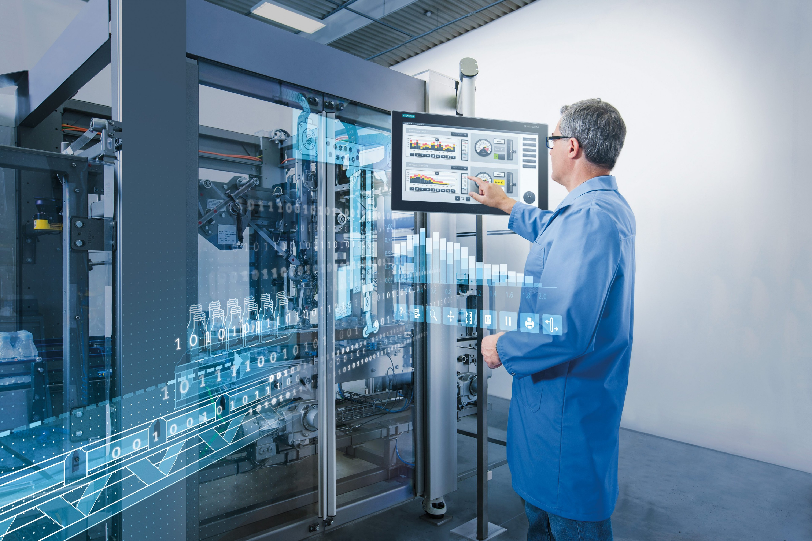
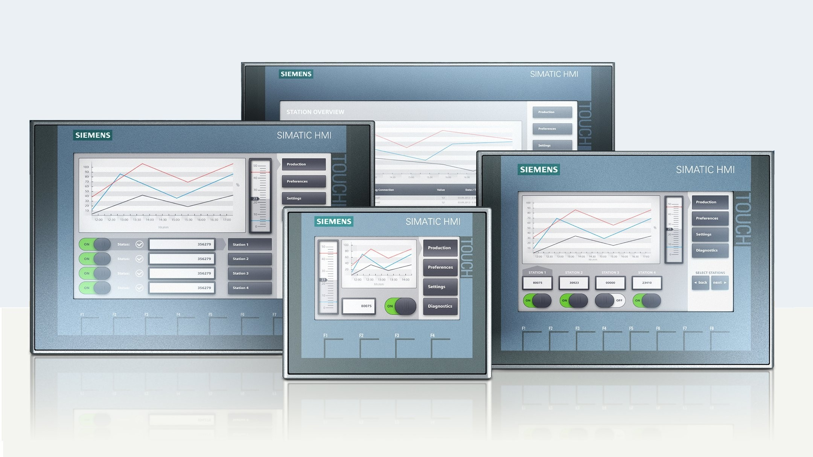
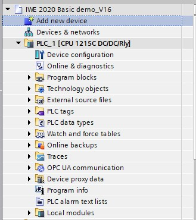
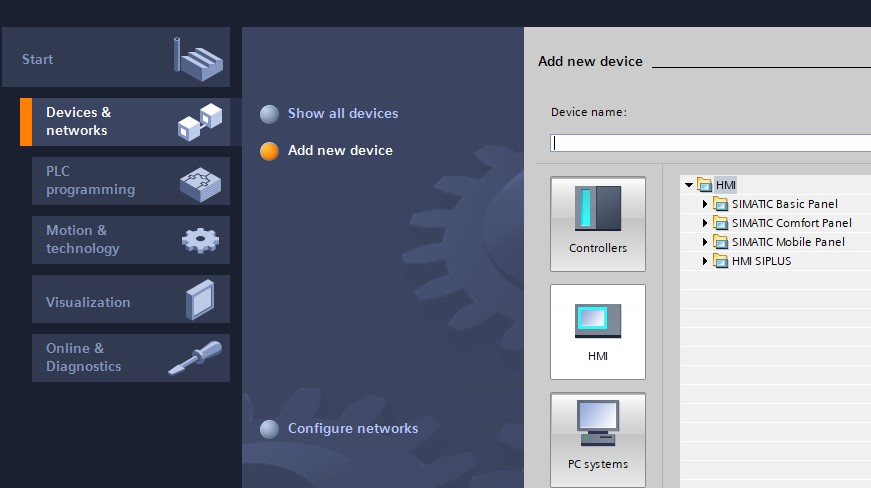
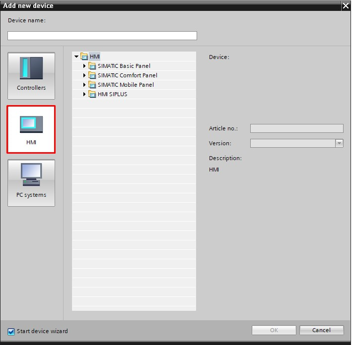
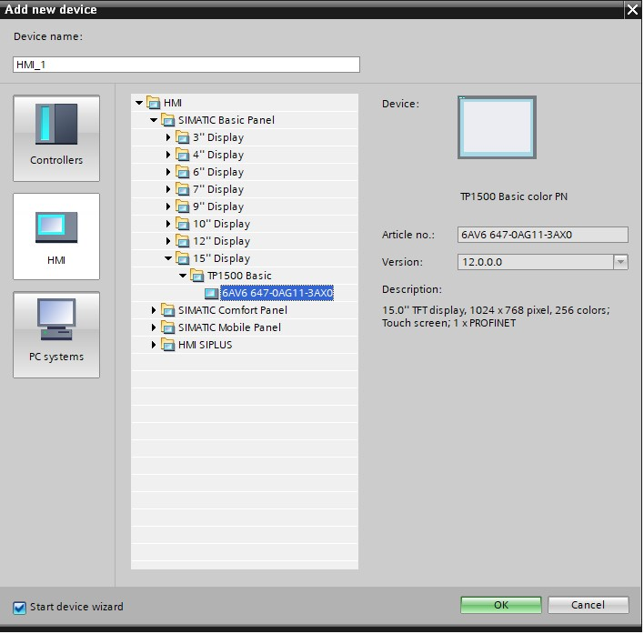

# HMI programming
_____________________________________
## Introduction
Due to production processes are becoming more and more complex and requirements for machine and plant functionality are increasing, operators need a powerful tool for controlling and monitoring production plants.

An HMI system (**h**uman-**m**achine **i**nterface) represents the interface between man (operator) and process (machine/plant). It is the controller that actually controls the process. Hence, there is an interface between the operator and WinCC (at the HMI device) and an interface between WinCC and the controller.

## Device description
The SIMATIC HMI Basic Panels product line features key and touch panels (operator input via keyboard and touch screen).

SIMATIC HMI Basic Panels are the ideal entry-level series for simple HMI applications. The device series offers panels with 4", 7", 9" and 12" displays, and combined key or touch operation.

The widescreen displays are high resolution with 64,000 colors. They can be installed in portrait mode and are especially energy-efficient due to their 100% dimmable brightness.

The user interface opens up a wide range of operations with improved usability through new controls and graphics. The USB interface allows you to connect a keyboard, mouse and barcode scanner and supports easy archiving of data on a USB stick.

## Hardware configuration
For a HMI to be correctly used in TIA Portal V16, one will need to make the right hardware configuration. For this to be correct you will need a correct CPU configuration mentioned in Addendum 3 of the ACTEA Basic PLC programming course.

To add a HMI to a current project you will have to add a new device. This can be done through the 2 views within TIA portal.

| Project View | Portal View |
| :---: | :---: |
|  "New Device"  |  "Devices & network > Add new device" |
|   |   |

The menu that pops up has 3 main options to select between Controllers / HMI / PC systems. For our example we'll be needing the HMI tab:

After which you select the desired HMI. HMI > SIMATIC Basic Panel (we'll be using the simulator of TIA Portal, for this example i took the KTP1500 Basic):

