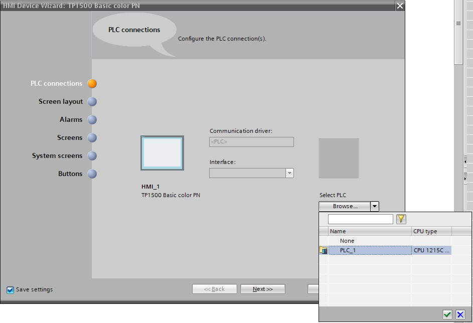
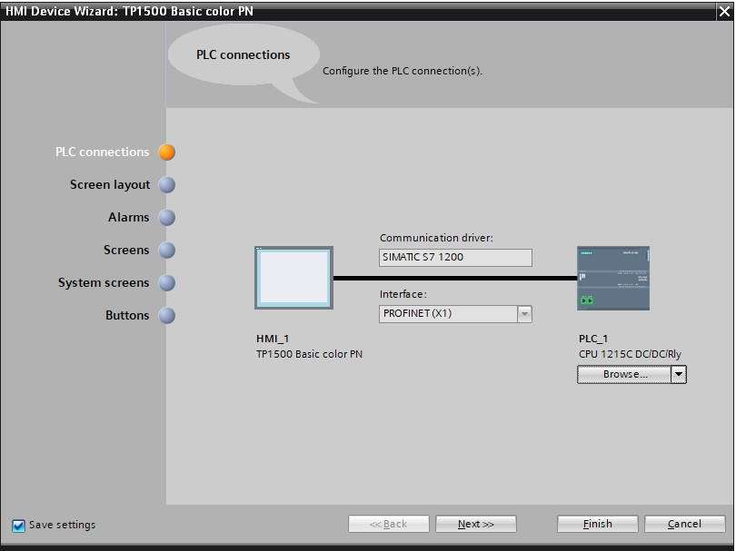
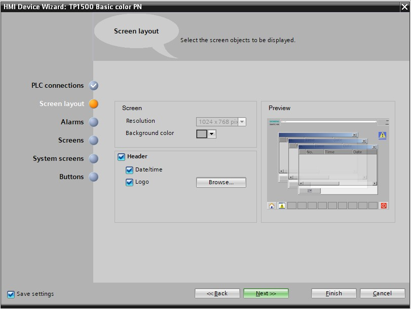
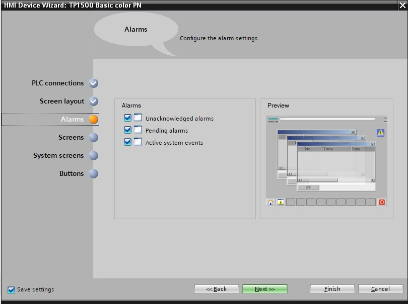
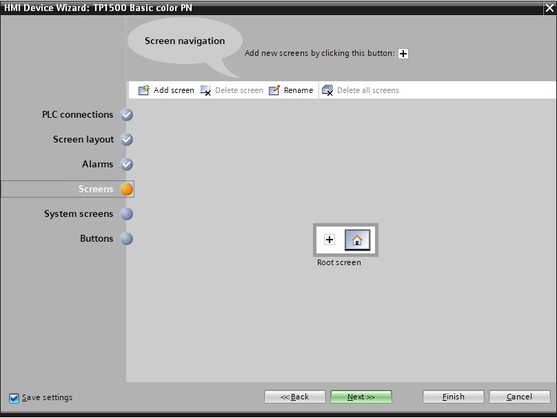
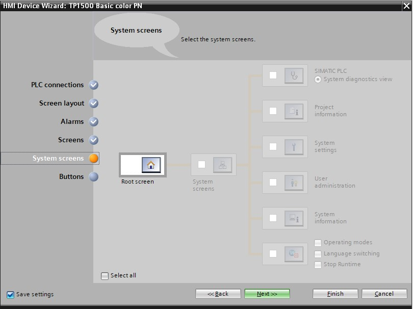
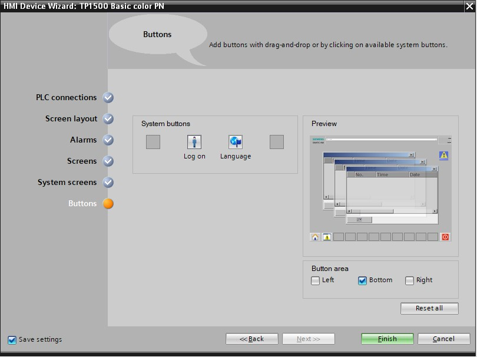

# HMI wizard

When you selected the correct/desired HMI you get the following screen presented:

Here you need to link the HMI to the correct PLC, this is done by selecting the right PLC under Select PLC -> PLC_1

If the correct PLC is selected it should automatically link the HMI to the PLC through ProfiNET.
Now proceed to the next screen by pressing "Next".

You can change the default background color of your panel under "Screen layout".
Select the "Header", "Date/time" and "Logo" check boxes. Confirm your selection by clicking on "Next ".

In the "Alarms" section, you can specify which of the alarms are to be displayed in a window. Select all three alarm types. Confirm your selection by clicking on
"Next".

In the "Screen navigation" section, the screen structure is displayed with the screen name of the last created project, starting with the root screen on the far left. A new name can be assigned simply by clicking on a screen name.
If you click on + you can insert new screens in the hierarchy ® and delete selected screens by clicking on "Delete screen".
Confirm your selection by clicking on "Next".

In the System screens section, you can select previously preset views for system functions and have them automatically added. Select all system screens by clicking "Select all". Confirm your selection by clicking on "Next".

In the System buttons section, you will find four user-selectable buttons for Exit(Runtime), Log on, Language and Root screen. You can place these buttons on the provided button areas "Left", "Bottom" or "Right" as desired. An "Open alarm window" button is already created.

Select only the "Button area", "Bottom".Insert the button for the "Root screen" on the left and the button for "Exit" Runtime on the right. Confirm your selection by clicking on "Finish".

