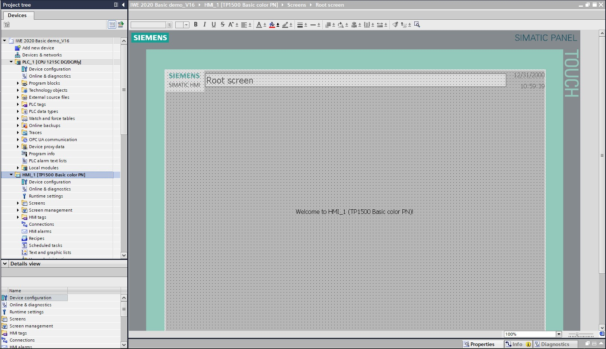
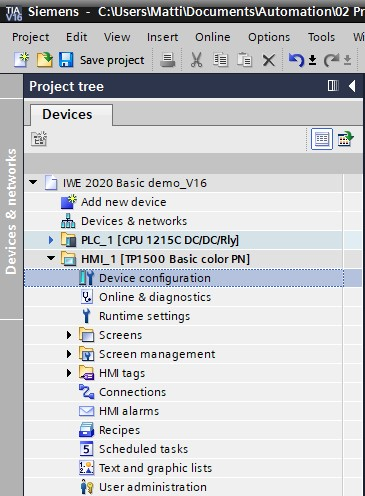
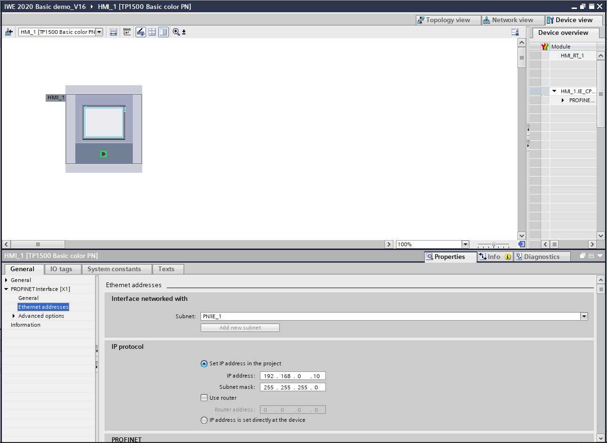
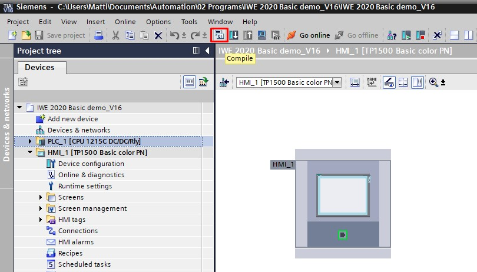
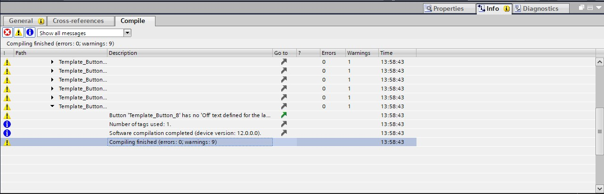

# Device configuration of HMI Panel

The TIA Portal now automatically changes to the Project view and displays the root screen of the visualization.

To configure the panel, select "Panel KTP700 Basic" in the project tree and open its "Device configuration" with a double-click.

## Setting the IP adress

Select the Ethernet interface of the panel in the Device view with a double-click.
Under "General" in "Properties", open menu item "PROFINET interface [X1]" and select in the "Ethernet addresses" entry.
Set the IP address "192.168.0.10" under IP protocol.

**Remarks**
–	The subnet mask was already set in the settings of the CPU 1215C and is automatically applied by the panel.

## Compiling the CPU and panel and saving the project

To compile the CPU, click on the "CPU_1214C" folder, and select the "Compile" button for compiling in the menu. To compile the panel, click on the "Panel KTP1500 Basic" folder, and select the "Compile" button for compiling in the menu. You can save your project by clicking on the "Save Project"  button in the menu.
( CPU_1215C > "Compile" > Panel KTP700 Basic > "Compile" > Save project  ).

In the "Info" area under "Compile", it is then shown whether the compilation was successful or whether warnings or errors occurred.

