_____________________________________

# Changin screens and objects
## Screens
After successful compilation, you want to design the first screen for the visualization. To do this, open the > "Root" screen with a double-click:

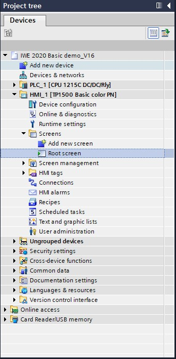

You will see a text box in the center of the screen, we will remove this by right clicking the text box and selecting "Delete". This also can be done by pressing you keyboard button "Delete".

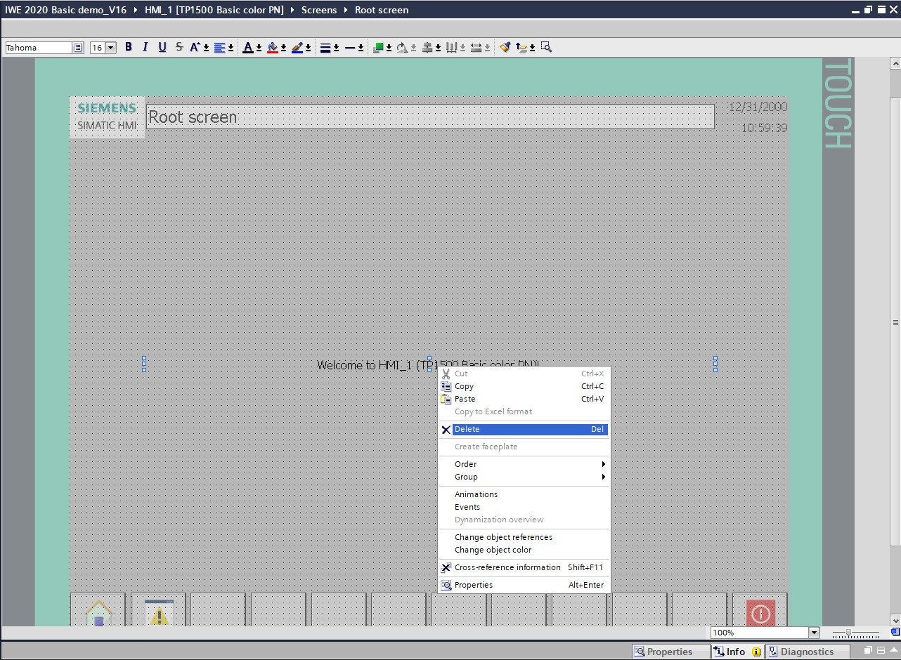

## Toolbox
These contain the most commonly used objects, elements and controls used in a HMI display.

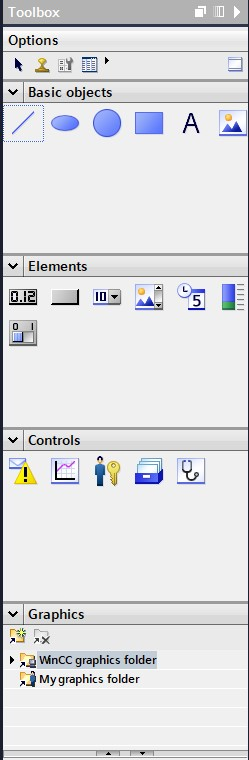

### Basic objects

The basic objects contain a text box, rectangle, circle, line, ellipse and a graphic view.
These are added by simply dragging them onto on the screen or selecting one in the toolbox section and clicking on the desired screen. To customise them further you'll have to click on the properties of the object. For example a rectangle, in the properties you can change the appearance, layout and miscelaneous.

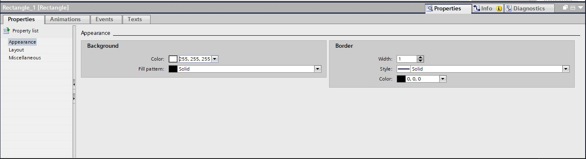

These properties are the same for all basic objects except for the text box and graphic view.
Graphic view has the ability to show custom images. This is done by selecting the grpahic view and placing it on a screen. Then in options you'll have to go to General > bottom button to add custom files. There is already a pre existing list of images you can choose from. But to add a custom image:
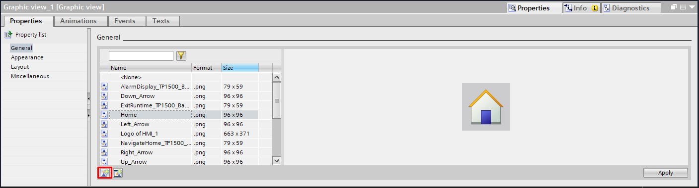

### Elements
The elements are objects that can be linked to actual PLC data / are ment to be used as a way of interacting with PLC data. These stock ones contain an I/O-Field, button, symbolic I/O-Field, graphical I/O Field, date/time field, bar and a switch. Once dragged into the screen you can change the appearance however you want and link them with the correct PLC data type. For example an I/O-Field.

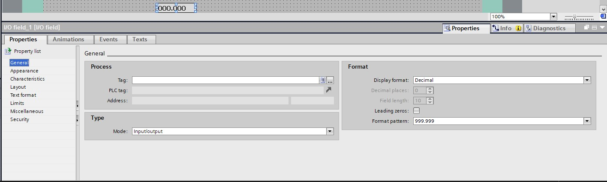

In the properties of this I/O field you can assign a Tag from the HMI or PLC to it. This will read out the value that tag has. An I/O field is mostly used for reading or giving in a desired value. In "format" you can customise how the value gets displayed. For example:

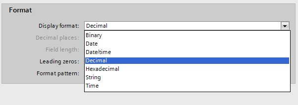

You can also change the type of I/O field by changing it to input or output only. Input only will only show input values. Output only will only allow a measured value to be displayed and NOT changed.

## Events

Each object or element can have events. These can change values, screens on the HMI, calculations scripts etc.. For an example we'll use a button to make it behave like a Start button.

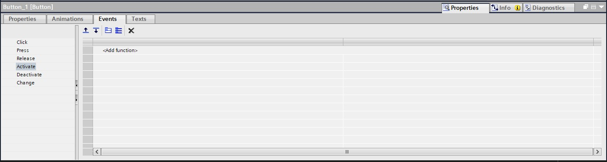

To assign a function to the button you click on "Properties" > "Events" > "Click" > "< Add function >" you will get the following selection.

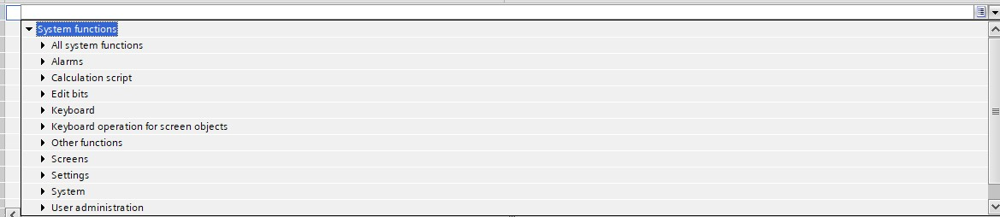

Select "Edit bits", in here there are several options of changing a bit. For a start button the most common function is "SetBitWhileKeyPressed", this will set the asigned bit to 1 while you press the button. If you release the button the bit value will be set to 0 again.

## Animations

### Display

Within the properties screen you can find the tab "Animations". After which you get the option to add either a **Display** or **Movements**. In this chapter i'll explain the **Display**.

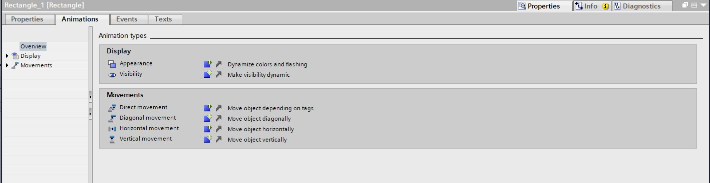

Within a display you can have a "Appearance" or "Visibility" animation. The appearance will give you the ability to change the colours of a object depending on a tag value. Visibility will give you the option to hide the object depending on a tag value.

### Movements

Within **movements** there are 4 different movements, direct movement, diagonal movement, horizontal movement and vertical movement. Direct movement will allow you to move a object from point A to B in a direct way. Diagonal movement will move from point A to B diagonally. Horizontal movement will move from point A to B horizontaly. Vertical movement will move from point A to B vertically.

Horizontal and vertical movement can be assigned to a tag value so that depending on that value the object will move towards one point. For example:

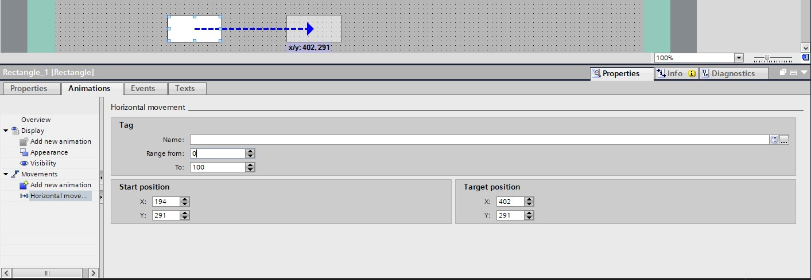

The range will determine how much of your tag value will be used (0-50 of the tag value will move your object between the two points in that range 0 being point A and 50 being point B).
