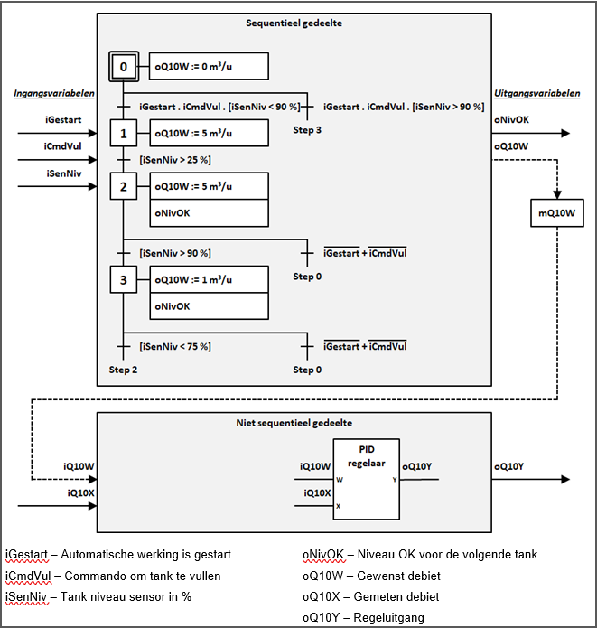

# GRAFCET
_____________________________________
## General
The implementation of an automated system requires, in particular, a description relating cause and effect. To do this, the logical aspect of the desired behaviour of the system will be described.

The **sequential part** of the system is the logical aspect of this physical system. The behavior indicates the way which the output variables depend on the input variables. The object of the GRAFCET chart is to specify the behavior of the sequential part of the system.

The **GRAFCET design language** is characterized by different graphical elements and by text that gives information about the variables. By connecting these various elements and text, the behavior of the automatic machine/installation is described.

This behavior is known as steps and a GRAFCET contains multiple steps. The evolution of one step to another is translated by one or several transitions.

A GRAFCET will be executed as follows:
-   A GRAFCET will run from top to bottom
-   A GRAFCET starts with an initial step
-   A transition is displayed as a mathematic boolean expression
-   The result of a transition is TRUE or FALSE
-   While the GRAFCET is executed there is at least one active step
-   Only steps connected to the active step can be executed
-   Other steps can be activated on the condition that they are connected with the active step if the result of the connected transition is TRUE

There are 5 programming languages included in the standard IEC 61131 including SFC[^1] which is inspired on the GRAFCET design language. However, there are some differences:
  -   SFC is a programming language
  -   GRAFCET is a design language
  -   The SFC program language uses other program languages, such as FBD and LAD, and different abbreviations to program transitions and actions
  -   The execution of an OR-convergence, if all conditions are TRUE, is  different

[^1]: SFC = Sequential Function Chart, Siemens uses the name GRAPH

        Conclusions
-	It is possible to program a GRAFCET in each programming language described in the standard IEC 61131
-	The SFC program language looks like GRAFCET design language but is not 100% the same 
