## GRAFCET

### General

Designing of software for a automated machine requires analyses where for
example the desired process is described.

The automatic procedure can be ran through a continue, sequential or a batch
process.

For a sequential function we opt to use a graphical GRAFCET design language to
clarify the function language to describe the method we use describe the
behaviour of the in- and outputs.
The GRAFCET design language is characterized by different graphical elements and
by text that gives information about the variables. By connecting these various
elements and text, the behaviour of the automatic machine/installation is
described.

Hereby will the working analyzed in different steps with corresponding actions.
Thereafter will the steps be connected with each other and provided with
conditions ( ex.: which sensor are required to be activated to start a actuator)

The sequential process will be executed as follows:

-   A GRAFCET will run from top to bottom

-   A GRAFCET starts with his initial step or source step

-   A condition is displayed as a mathematic Boolean expression

-   The result of a condition is TRUE or FALSE

-   While the GRAFCET is executed there is at least one step active

-   Only steps connected to the active step can be executed

-   Other steps can be activated on condition that they are connected with the
    active step if the result of the connected condition TRUE is.

_Image 4-53 : Graphical representation of a sequential proces_

  There are 5 program languages included in the norm IEC 61131 with one of them
  being SFC[^1]

  [^1]: SFC = Sequential Function Chart, Siemens uses the name GRAPH

  This SFC program language is inspired on the GRAFCET design language but is
    different:

  -   SFC is a program language

  -   GRAFCET is a design language

  -   The SFC program language uses other program languages and different
      abbreviations to program conditions and actions, because of this is
      displaying SFC different to GRAFCET

  -   The execution of a OR-convergence if all conditions are TRUE, is different
        in the SFC Program language and the GRAFCET design language

I        Conclusions
-	It is possible to design a GRAFCET for a prefered program language
-	The SFC program language looks like Grafcet design language but is not 100% the same

### Designing of a GRAFCET in IEC 60848

#### GRAFCET diagram

| **Symbol** | **Description**                                                                                                                                                                                                                                      |
|------------|------------------------------------------------------------------------------------------------------------------------------------------------------------------------------------------------------------------------------------------------------|
|    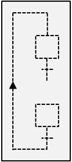        | A GRAFCET diagram is a collection of steps, actions, conditions, connections, etc. these form a complete diagram. Commonly shortened to GRAFCET The collection of all elements is surrounded by a rectangle this forms the complete GRAFCET diagram. |
|            | **Input variables** are left of the rectangle provided with a incoming arrow/ **Example**: Initial step active and installation started conditions                                                                                                      |
|            | **Output variables** are right of the rectangle provided with a outgoing arrow. **Example**: Forward and backwards signals.                                                                                                                               |
|    "*"        | **Comment** clarifies the working of certain partsn, is written between dubbel quotation marks whereby the asterisk symbol gets replaced with the description. **Example**: Stopping drainpumps if the level is to low.                                   |

_Tabel 4-111 : GRAFCET diagram_

#### Step

A **step** displays a defined condition of the sequential proces. A step can
take 2 values,

-   Active

-   Not Active

On a certain moment while the evolution of the sequential proces:

-   Is a step active or not active

-   The set of active steps determines the state of the process

-   The GRAFCET determines which step or steps can become active

| **Symbol** | **Descpription**                                                                                                                                                                                                                                                                                                                                                                                                                                                                                                                                                                     |
|------------|--------------------------------------------------------------------------------------------------------------------------------------------------------------------------------------------------------------------------------------------------------------------------------------------------------------------------------------------------------------------------------------------------------------------------------------------------------------------------------------------------------------------------------------------------------------------------------------|
|            | A **step** is shown as a square with a unique label. For practical reasons the most commonly used label are numbers this replaces the asterisk symbol. **Example**: Step 2                                                                                                                                                                                                                                                                                                                                                                                                                   |
|            | The **initial step** characterises the startcondition and is displayed as a dubble square. In case of the initial step being active then all other steps in the GRAFCET won’t be active. The standard of a step is  De afspraken m.b.t. een stap zijn van toepassing. The usage of multiple initial steps is allowed but the most used application is the use of only one. _Example_: Step 0 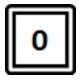                                                                                                                                                                                           |
|            | A **enclosed step** displays that this step has more enclosed steps. If the conditions after the enclosed step are TRUE, will we proceed to the next step and all internal steps will be inactive.  It is allowed that a enclosed step multiple GRAFCET diagrams contain, but the enclosed internal steps can only be assigned to one included step The rules of a step are applicable.                                                                                                                                                                                              |
|            | A **enclosed initial step** displays that this step has multiple internal steps that participate in the initial condition. The enclosed initial step contains minimum one internal initial step and can contain multiple GRAFCET diagrams. The rules of a step are applicable.                                                                                                                                                                                                                                                                                                       |
|            | A **macro step** displays that this step has multiple internal steps at which we can describe it as a clearly defined piece of software code. A macro is not designed as standalone software, it’s mean to support a different piece of software. The internal steps always start with a source step and always end with a end step. Only in the case of the end step being active can the macro exit. Unlike an enclosed step a macro contains maximum one GRAFCET diagram and the asterisk symbol gets replaced by one unique label that can deviate from step labels, numbering.  |
|   |   In case of a **active step** needing to be displayed urgently will this be done by placing a point under the label.|
_Tabel 4-112 : GRAFCET steps_
#### Connectionelementens

| **Symbol** | **Description**                                                                                                                                                                                                                                                         |
|------------|-------------------------------------------------------------------------------------------------------------------------------------------------------------------------------------------------------------------------------------------------------------------------|
|            | Connectionelements are lines in the network that connect all the steps.                                                                                                                                                                                                 |
|            | Both horizontal and vertical lines can be used Slantwise connections are to be avoided, they are allowed, but are only to clarify.                                                                                                                                      |
|            | The flow of a connection is always from top to bottom. Arows only get used if this can’t be followed or to clarify the situation.                                                                                                                                       |
|        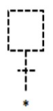    | In case a connection needs to disconnected (ex. when multiple pages are needed for complex GRAFCET) then the label will be displayed in the next step. In case the next step is on a different page will the page number added. **Example**: Reference to step 12 on page 2 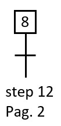|

_Tabel 4-113 : GRAFCET connectionelementens_

#### Condition

| **Symbol** | **Description**                                                                                                                                                                                                                                                                                                                                                                                                     |
|------------|---------------------------------------------------------------------------------------------------------------------------------------------------------------------------------------------------------------------------------------------------------------------------------------------------------------------------------------------------------------------------------------------------------------------|
|     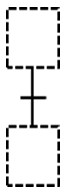       | A condition between two steps will be indicated by a horizontal line right through the connection line. The condition is active if the previous step is active. Between 2 steps is only one condition allowed.                                                                                                                                                                                                      |
|       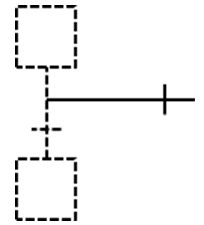     | It’s allowed to use vertical stripes over a horizontal connection line for graphical reasons.                                                                                                                                                                                                                                                                                                                       |
|            | Each transition contains a transitioncondition. This is a mathematical boolean expression composed by variabels, they repalce the asterisk symbol and they are TRUE or FALSE. The transition condition is always drawn right of the transition.  Of all available information, on one instance, contains the transitioncondition only the needed to overwrite the transition. **Example**: Start button AND stop button  |
|    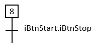        | A transition may be optionally provided with unique numbering between \*haakjes\* that are left of the transition. **Example**: Label 6                                                                                                                                                                                                                                                                                 |
|            | A transition condition that is always TRUE is displayed with the expression 1.                                                                                                                                                                                                                                                                                                                                      |
|            | The status of one step (active or not active) can be added in a transition condition the letter x at which the asterisk symbol will be replaced by a label of the step **Example**: Step variable of step 7                                                                                                          |       |                                                                                                                                                                                                                                               |
|     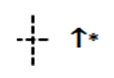      | The rendering of a increasing flank in a variable will be displayed with a upwards arrow “”. **Example**: The transitioncondition is TRUE on both increasing flanks of the door open sensor OR in case the switch of the door is acted on..    |   |   |
| 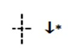| Displaying a decreasing flank in a variable will be displayed with a downwards arrow “”. Example: The transition conditoin is TRUE on a decreasing flank of the fotocel pallet present.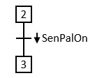                                                                                                                                                                                                                                                                                                      |
| 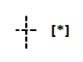| A **comparisoninstruction** is noted between right \*haakjes\* at which the asterisk symbol gets replaced with a comparison. The result of a comparison instruction is TRUE or FALSE. **Example**: The transitioncondition is TRUE in case the actual pressure is higher than 5,0 bar.      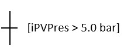                                                                                                                                                                                                     |
| |The display of a variable that is time dependent is displayed by the **/** symbol. Hereby is the transitioncondition TRUE after a rise delay and stays TRUE with a drop-out delay It is allowed to simplify the notation by removing the drop-out delay in case this isn’t in use. **Example**: The transition condition is TRUE 2 s after the iSen TRUE is and stays 5s TRUE after iSen FALSE is.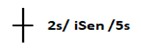 **Example**: 3 s after step 4 is active is the transition condition TRUE and step 5 will be active.
|   |  A **source transition condition** is a transitioncondition without previous step. Each time the transition condition is TRUE will the next step be activated. It is recommended to provide a transition condition with a rising or dropping flank to avoid the activation of the next step. **Example**: The initialisation step 0 will be activated on a rising flank from the initialisation input signal. 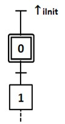 |
|  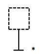 |  A **end transition condition** is a transition condition where no step follows. Each time the transition condition is TRUE will the upwards steps be disabled.  **Example**:   Sequnce with initialisation of a sourcestep where al steps get activated 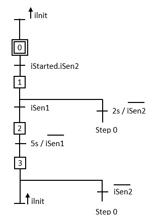|
  Explanation symbolic image
  -	iInit = digital input – GRAFCET initialise
  -	iGestart = digital input – Result of a start-stop circuit
  -	iSen1 = digital input – Sensor 1
  -	iSen2 = digital input – Sensor 2
  #### Action

  | **Symbol** | **Description**                                                                                                                                                                                                                                                                                                                                                                                                                                                                                                                                        |
  |-------------|---------------------------------------------------------------------------------------------------------------------------------------------------------------------------------------------------------------------------------------------------------------------------------------------------------------------------------------------------------------------------------------------------------------------------------------------------------------------------------------------------------------------------------------------------------|
  |             | An **action** is assigned to a step and gets illustrated by a rectangle which is connected to that step with a horizontal line. It is permitted to use multiple actions in one step if all of the have their own rectangle. **Allowed multiple actions:** 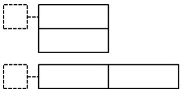                                                                                                                                                                                                                                           |
  |    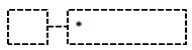         | Each action has a action label which clarifies to the executed task. The preference goes to the use of variables instead of written text. The label gets written in the rectangle where a asterisk symbol gets replaced with the variable. A **continue action** will have the status of the variable TRUE on the moment the corresponding step is active. On all other mometns the action is FALSE.Example: The pump action is TRUE in step 4 and FALSE in step 5                                      |
  |             | A **memory action** has a specific value assigned to a variable which gets stored.The asterisk symbol gets replaced by a variable  and the \# symbol gets replaced by a (mathematical) value, formula, ..... **Example:**The lamp gets activated in step 7, is still activated in step 8 en turns off in step 9. The interal variable sx gets increased with 1 in step 8.   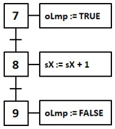                                                                                                                                            |
  |       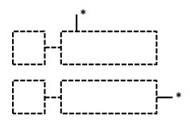      | A **conditional action** gets the status TRUE in case of the corresponding step being active and the assigned actioncondition is TRUE. **Example:** The disapproval lamp lights up in case the amount of disapproved parts are bigger then 3 in case step 5 is active. 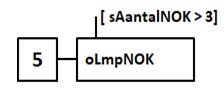                                                                                                                                                                                                                                                                                      |
  |             | A conditional action that is time dependent gets displayed with the "/"symbol. In which the action is TRUE after a rise delay and stays TRUE with a decrease delay. It is allowed to simplify the spelling by removing the decrease delay in case this isn't applicable. **Example:** 2s After iSen TRUE is will valve A+ be activated. After 5s iSen being FALSE will valve A+ be deactivated in case that step 9 is active. **Example**  3s after step 4 is active will the OK lamp light up. |
  |    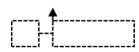         | It is possible to run a memory action with the activation of a step. This is indicated with a upwards arrow. **Example** With the activation of step 8 the formula will be ran. 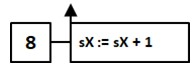                                                                                                                                                                                                                                                                                                                                              |
  |             | It is possible to run a memory action with the deactivation of a step. This will be shown as a downwards arrow.                                                                  |   |
Explanatino symbolic image
-	oPomp = digital output – Activation pump
-	oLmp = digital output – Lamp
-	oLmpOK = digital output – OK lamp
-	oVenA_1 = digital output – Valve A uitsturen (+ side)
-	sX = numeber variable X
-	sAantalNOK = number variable – amountl NOK parts
#### Structurs

| **Symbol** | **Description**                                                                                                                                                                                                                                                                                                                                                                                                                                                                                                                                                                                                                                                                                                 |
|-------------|------------------------------------------------------------------------------------------------------------------------------------------------------------------------------------------------------------------------------------------------------------------------------------------------------------------------------------------------------------------------------------------------------------------------------------------------------------------------------------------------------------------------------------------------------------------------------------------------------------------------------------------------------------------------------------------------------------------|
|      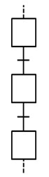         |A sequence is a sequence of steps whereby each step max one transition condition has. The sequence is active in case that minimum one step of the sequence is active. The sequence is inactive when all steps are inactive.                                                                                                                                                                                                                                                                                                                                                                                                    |
|             | A simple **loopsequence** is a sequence of steps whereby each step max one trnasition condition has and which the last step is connected to the first step.                                                                                                                                                                                                                                                                                                                                                                                                                                   |
|       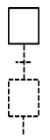      | A **sequence with sourcestep** has a step without previous transition condition. **Example:** Sequence with a initialising sourcestep.                                                                                                                                                                                                                                                                                                                                                                                                                                                                                                                                                                         |
|      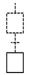       | A **sequence with endstep** has a step where there are no transition conditions after it. A endstep (and a sourcestep) are necessary with macro's.                                                                                                                                                                                                                                                                                                                                                                                                                                                                                |
|             | It is possible to skip a few step with a **forward sequence jump**. Notice that between 2 steps only one transtion is allowed.                                                                                                                                                                                                                                                                                                                                                                                                                                                                                                                                      |
|      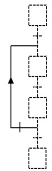       | It is possible to skip a few steps with a **backwards sequence jump**. This makes it possible to repeat a sequence. Notice that between 2 steps only one transition is possible.                                                                                                                                                                                                                                                                                                                                                                                                                                                                            |
|             | Using a **OR-convergence** makes it possible to choose between different sequences where between 2 steps only one transition is allowed.The designer needs to make sure that both sequendes can't be activated at the same time. Example In the GRAFCET version A it is possible to activate both step 4 and 5. This can happen when iSen1 and iSen2 have the status TRUE and on the moment step 3 is active. In the GRAFCET version B it isn't possible due to the extended transition condition..                                                                                                                                        |
|             | Using a **AND-Convergence** allows us to use multiple steps and sequence at the same time. Parralel sequences will be started after a transitioncondition. A AND-Convergence gets displayed with the use of a dubbel line. Once the parralel sequence is activated both sequences will run seperatly from each other. At the end a AND-Convergence  gets syncchronised this happens by leaving both sequences and converging back to one step. This gets displayed by a double line before activating that step. Both endsteps need to be active and the transition conditions need to be TRUE for this to happen. |

Tabel 4-116 : GRAFCET structurs
#### Fucntioning

The **functioning of a GRAFCET** in general runs step by step.
In case a step is active can only the next step be active incase the transtion conditions is TRUE. If the next step gets activated the previous step will be deactivated inmediatly

It is possible that the status of the different transtion conditions the functioning of a GRAFCET seeming not torun step by step. It is the task of the designer to avoid that function which can cause a unstable function of actions.

| **Function** | **Description**                                                                                                                                                                                                                                                                                                                                                                                                                                                                                                        |
|-------------|-------------------------------------------------------------------------------------------------------------------------------------------------------------------------------------------------------------------------------------------------------------------------------------------------------------------------------------------------------------------------------------------------------------------------------------------------------------------------------------------------------------------------|
  |        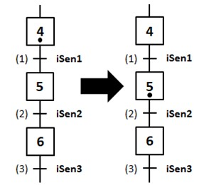     | With a **not transient function** will the function run step by step. Situation: Step 4 active iSen1 = iSen2 = Isen3 = FALSE Function: iSen1 (1) is TRUE which activates step 5 en deactivates step 4.                                                                                                                                                                                                                                                                                    |
|     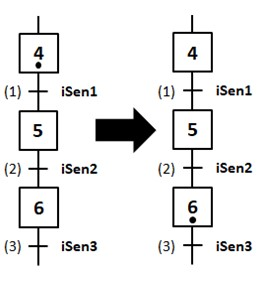        | With a **transient function** will the steps not run step by step. Situation Step 4 active iSen1 = iSen3 = FALSE iSen2 = TRUE Function: iSen (1) is TRUE which causes step 5 to be activated and step 4 gets deactivated. Because iSen3 (2) is true will step 6 inmediatly be activated and step 5 will be deactivated. Downside: In case we use with action instead of memory actions, it is possible that the assigned actions of a transient step not or shortlived gets executed (= unstable function).|
|               | With a **AND-Convergence** parralel sequences will be started in case the previous transition condition is TRUE. Situation 1: If step 1 is active and transition conditoin iGestart is TRUE then step 2 and 4 will be activated.   Situation 2: Once the parralel sequence are activated they'll run seperatly.   Situation 3: Step 9 gets activated in case step 3 and step 6 is active and in case the transitioncondition iSen1.iSen2 are TRUE.                                                                                                                                                                                     |Tabel 4-117 : GRAFCET fucntion|
#### Example
In the next example the GRAFCET is shown as the function of a conveyorbelt where a box is that goes 5x from start to end before it stops. After which the conveyorbelt needs to be restarted

 

Figuur 454 : Conveyorbelt GRAFCET exaple

De GRAFCET has the name FB_PE_BandVwAw:

-   FB = GRAFCET will be programmed in a function block (FB)

-   PE = Displays that this building block is part of the procedure[^2] element element is

    [^2]: Procedure = A series of instructions that run in order

-   BandVwAw = Conveyorbelt upwards and downards

The conveyorbelt gets **started and stopped** with a start and stop button. The function of these buttons is not included in the GRAFCET but get executed with the use of a combination start-stop basiccircuit. The result of this start-stop basic circuit will be linked with the GRAFCET inputvariable "iGestart"

 
 Figure 455 : Processing start-stop with GRAFCET example

Each time that the stop button gets pressed the conveyorbelt will inmediatly stop (box stops moving). As soon as the start button gets pressed again will the GRAFCET continue where it left of.

Figure 456 : Conveyorbelt GRAFCET

The **Photocell** sensors on a conveyorbelt detect the presence of the box and the infra red beams between photocell and reflector gets disconnected. The status of Photocells (%I) gets linked with the GRAFCET inputvariable "iSenVW" and "iSenAw"

Figure 457 : Proccesing of sensors with GRAFCET example

Controlling the conveyorbelt forwards and backwards will be determined by step 1 and step 2 on condition that the installation is started (result of the combination basic start stop circuit)

Figuur 458 : Controlling the forward and backwards movement GRAFCET example

The effective **control of the conveyorbelt** happens by the GRAFCET outputvariables "oBandVw" and "oBandAw" which are linked with the contactors (%Q) and the conveyorbelt motor (asynchrone motor)

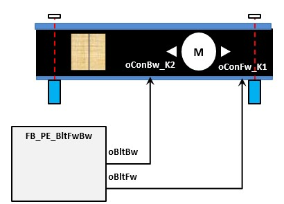

Figuur 459 : Verwerking contactoren bij GRAFCET voorbeeld

Counting of the **amount back and forward movement** gets controlled by the internal INT variable "i". This variable is a internal function block parameter of the type STATIC. This makes it possible to remember the condition of variable "i" also without voltage (=remanent)

 
 Increasing the variable "i" is executed in step 3. Afterwhich step 1 gets activated because there is a loopsequence between step 3 and step 1 but only if the value of the variable "i" smaller is then the decimal value 5. Noticed that hte increasing of the variable "i" only gets executed on the moment that step 3 is active (rising flank). This is to prevent wrongly increasing the value of the variable in case step 3 is active longer the one cyclus.

In case the box went 5x back and forward will this be displayed with a green OK lamp. This lamp (%Q) is connected with GRAFCET outputvariables "oOk". Now the installation needs to be stopped with the stop button before the installation can restart.

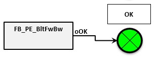

Figure 460 : Processing lamp with GRAFCET example

It is possible to **Initialise** the GRAFCET. This is the activation of the initial step (step 0) by using GRAFCET inputvariable "iInit". All the other active steps get deactivated. The initialising is only activated on te rising flank of "iInit" GRAFCET inputvariable.
 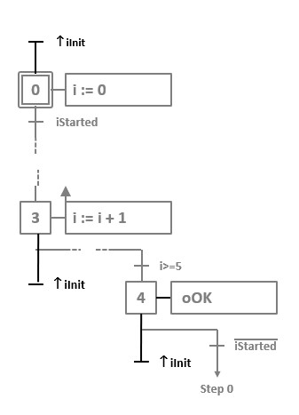

Figure 461 : Initialising GRAFCET example

You could choose to initialise the installation in case you press the start and stop button simultaneously for 5 seconds or more.

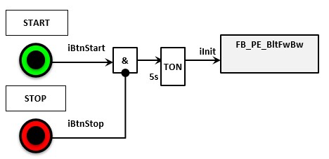

Figure 462 : Activating of GRACET initialisation via start and stop buttons
### GRAFCET programmation in LAD/FBD using BOOL

Converting a **GRAFCET design to softwarecode** gets desmostrated with the GRAFCET *Figure 456 : conveyorbelt GRAFCET*.

The GRAFCET gets programmed in the LAD or FBD programminglanguage in the function block (%FB). Hereby can we use STATIC parameters that remeber their status also without voltage (RETAIN)

| **Manufacturer** | **Parameter interface** |
|---------------|-------------------------|
| Beckhoff      |                         |
| Siemens       |                         |

Tabel 4118 : Parameter interface - GRAFCET programming in LAD/FBD  BOOL
(Projectdetail in TwinCAT 3, © 2020 Beckhoff & TIA Portal V15 SP1, © 2020
Siemens)

The programmation gets split in **3 parts** which chronologically get programmed in different networks:
-   Initialisation (network 1)
-   Transitionconditions (network 3 ... X)
-   Actions (network x+1 ... last network)

The **GRAFCET prgramming in LAD/FBD with BOOL** variables is build on the ideaoligy

-   Each step has assigned BOOL variables

-   In case this variables is TRUE, the step will be active

-   We use ARRAY whereby the ARRY number is teh same as the GRAFCET step number

-   Initialisations input "iInit" is always present which causes the initial step to be active on a flank signal of this input

-   Input "iGestart" is always present which is the result of the combination start-stop circuit that tells teh GRAFCET its status
| **Manufacturer**  | **Programmation** |
|----------------|-------------------------|
| Beckhoff (LAD) |                         |
| Siemens (FBD)  |                         |

Tabel 4119 : Initialisation - GRAFCET programmation in LAD/FBD with BOOL
(Projectdetail in TwinCAT 3, © 2020 Beckhoff & TIA Portal V15 SP1, © 2020
Siemens)

| **Manufacturer**  | **Programmation** |
|----------------|-------------------------|
| Beckhoff (LAD) |                                |
| Siemens (FBD)  |    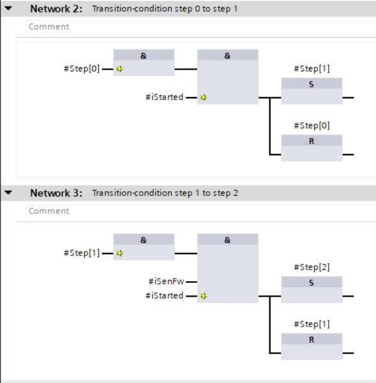                      |

Tabel 4120 : Transition Conditions - GRAFCET programmation in LAD/FBD using BOOL
(Projectdetail in TwinCAT 3, © 2020 Beckhoff & TIA Portal V15 SP1, © 2020
Siemens)

| **Manufacturer**  | **Programmation** |
|----------------|-------------------------|
| Beckhoff (LAD) |                   |
| Siemens (FBD)  |                         |

Tabel 4121 : Actions - GRAFCET programmation in FBD using BOOL (Projectdetail in
TwinCAT 3, © 2020 Beckhoff & TIA Portal V15 SP1, © 2020 Siemens)

| **Advantages**                  | **Disadvantages**                                                                         |
|--------------------------------|-------------------------------------------------------------------------------------|
| Simplicity (1 step = 1 variable) | Initial step is not activated during the first download of the program |
|                                | Monitoring of active is more complicated than with other variables        |

Tabel 4122 : Advantages and disadvantages  using GRAFCET programmatie in LAD/FBD using BOOL
### GRAFCET programmation in LAD/FBD using INT

Converting a **GRAFCET design to softwarecode** gets desmostrated with the GRAFCET *Figure 456 : conveyorbelt GRAFCET*.

The GRAFCET gets programmed in the LAD or FBD programminglanguage in the function block (%FB). Hereby can we use STATIC parameters that remeber their status also without voltage (RETAIN)

| **Manufacturer** | **Parameter interface** |
|---------------|-------------------------|
| Beckhoff      |                         |
| Siemens       |                         |

Tabel 4123 : Parameter interface - GRAFCET programmation in LAD/FBD using INT
(Projectdetail in TwinCAT 3, © 2020 Beckhoff & TIA Portal V15 SP1, © 2020
Siemens)

The programmation gets split in **3 parts** which chronologically get programmed in different networks:
-   Initialisation (network 1)
-   Transitionconditions (network 3 ... X)
-   Actions (network x+1 ... last network)

The **GRAFCET prgramming in LAD/FBD with BOOL** variables is build on the ideaoligy

-   Only the acutal step(s) need to be known

-   The actual step(s) as INT nubmer(s) are displayed with one or more variables

-   Incase decimal values of these variable(s) are equal to a GRAFCET stepnumber then the GRAFCET will be active

-   There's always a initialistion input "iInit" that makes it so that the intial step is active on a rising flank signal on this input

-   The initial step is automatically active the first time you do a software download to the PLC; this is because the INT nubmer standard the decimal value 0 has.

-   There's always the input "iGestart" which is the result of the combination start stop circuit which gives info to the GRAFCET

| **Manufacturer**  | **Programmation** |
|----------------|-------------------------|
| Beckhoff (FBD) |                         |
| Siemens (LAD)  |                         |

Tabel 4124 : Initialisation - GRAFCET programmation in LAD/FBD using INT
(Projectdetail in TwinCAT 3, © 2020 Beckhoff & TIA Portal V15 SP1, © 2020
Siemens)

| **Manufacturer**  | **Programmation** |
|----------------|-------------------------|
| Beckhoff (FBD) |                         |
| Siemens (LAD)  |                         |

Tabel 4125 : Transitionconditions - GRAFCET programmation in LAD/FBD using INT
(Projectdetail in TwinCAT 3, © 2020 Beckhoff & TIA Portal V15 SP1, © 2020
Siemens)

| **Manufacturer**  | **Programmation** |
|----------------|-------------------------|
| Beckhoff (FBD) |                         |
| Siemens (LAD)  |                         |

Tabel 4126 : Actions - GRAFCET programmation in LAD/FBD using INT (Projectdetail
in TwinCAT 3, © 2020 Beckhoff & TIA Portal V15 SP1, © 2020 Siemens)

| **Advantages**                                                                  | **Disadvantages**                                                                 |
|--------------------------------------------------------------------------------|-----------------------------------------------------------------------------|
| Initial step is activated during the first download of the program | Complexer, advanced programation then with LAD/FBD BOOL variant         |
| Monitoring of active steps is easier                           | Programmation of AND-Convergence is complexer then with LAD/FBD BOOL variant |

Tabel 4127 : Advantages and disadvantagesGRAFCET programmation in LAD/FBD using INT
### GRAFCET programmation in ST

Converting a **GRAFCET design to softwarecode** gets desmostrated with the GRAFCET *Figure 456 : conveyorbelt GRAFCET*.

The GRAFCET gets programmed in the ST programminglanguage in the function block (%FB). Hereby we can use STATIC parameters that remeber their status also without voltage (RETAIN)

| **Fabrikant** | **Parameter interface** |
|---------------|-------------------------|
| Beckhoff      |                         |
| Siemens       |  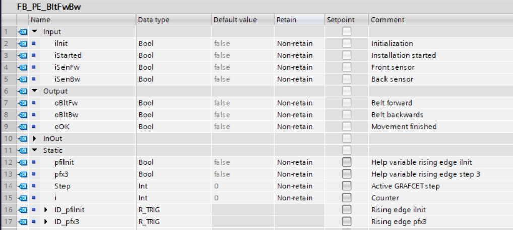                       |

Tabel 4128 : Parameter interface - GRAFCET programmation in ST (Projectdetail in
TwinCAT 3, © 2020 Beckhoff & TIA Portal V15 SP1, © 2020 Siemens)

The programmation gets split in **3 parts** which chronologically get programmed in different networks:
-   Initialisation (network 1)
-   Transitionconditions (network 3 ... X)
-   Actions (network x+1 ... last network)

The **GRAFCET prgramming in ST** variables is build on the ideaoligy

-   We use  CASE .. OF .. ELSE control structure which handles the processing of transitionconditions

-   We use INT datatype for displaying the actual step(s), this is because the control structur a ANY_INT datatype requires

-   Incase the decimal value of these variable(s) is equal to a GRAFCET stepnumber then the GRAFCET step is active

-   There's always a initialistion input "iInit" that makes it so that the intial step is active on a rising flank signal on this input

-   The initial step is automatically active the first time you do a software download to the PLC; this is because the INT nubmer standard the decimal value 0 has.

-   There's always the input "iGestart" which is the result of the combination start stop circuit which gives info to the GRAFCET

| **Manufacturer** | **Programmation** |
|---------------|-------------------------|
| Beckhoff      |                         |
| Siemens       |                           |

Tabel 4129 : Initialisation - GRAFCET programmatie in ST (Projectdetail in
TwinCAT 3, © 2020 Beckhoff & TIA Portal V15 SP1, © 2020 Siemens)

| **Manufacturer** | **Programmation** |
|---------------|-------------------------|
| Beckhoff      |                          |
| Siemens       |                           |

Tabel 4130 : Overgangsvoorwaarden - GRAFCET programmatie in ST (Projectdetail in
TwinCAT 3, © 2020 Beckhoff & TIA Portal V15 SP1, © 2020 Siemens)

| **Manufacturer** | **Programmation** |
|---------------|-------------------------|
| Beckhoff      |                            |
| Siemens       |                           |

Tabel 4131 : Actions - GRAFCET programmation in ST (Projectdetail in TwinCAT 3, ©
2020 Beckhoff & TIA Portal V15 SP1, © 2020 Siemens)

| **Advantages**                                                                       | **Disadvantages**                                                                 |
|-------------------------------------------------------------------------------------|-----------------------------------------------------------------------------|
| Initial step is not activated while the the first download of the program | Complexer programmation than LAD/FBD variant                             |
| Smaller programmation then LAD/FBD variant                                         | Programmation of AND-Convergence is complexer than the LAD/FBD BOOL variant |
| Monitoring of the active steps are easier                                 | Debugging [^3] in ST is harder than in FBD/LAD                             |

[^3]: Debugging = Searching for (programmation) mistakes

Tabel 4132 : Advantages and disadvantages GRAFCET programmation in ST
