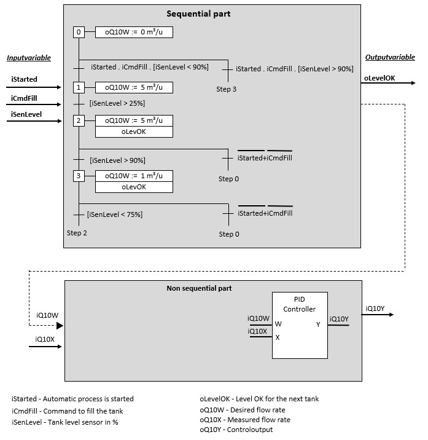

## GRAFCET

### General

Designing of software for a automated machine requires analyses where for
example the desired process is described.

The automatic procedure can be ran through a continue, sequential or a batch
process.

For a sequential function we opt to use a graphical GRAFCET design language to
clarify the function language to describe the method we use describe the
behaviour of the in- and outputs.
The GRAFCET design language is characterized by different graphical elements and
by text that gives information about the variables. By connecting these various
elements and text, the behaviour of the automatic machine/installation is
described.

Hereby will the working analyzed in different steps with corresponding actions.
Thereafter will the steps be connected with each other and provided with
conditions ( ex.: which sensor are required to be activated to start a actuator)

The sequential process will be executed as follows:

-   A GRAFCET will run from top to bottom

-   A GRAFCET starts with his initial step or source step

-   A condition is displayed as a mathematic Boolean expression

-   The result of a condition is TRUE or FALSE

-   While the GRAFCET is executed there is at least one step active

-   Only steps connected to the active step can be executed

-   Other steps can be activated on condition that they are connected with the
    active step if the result of the connected condition TRUE is.

_Image 4-53 : Graphical representation of a sequential proces_

  There are 5 program languages included in the norm IEC 61131 with one of them
  being SFC[^1]

  [^1]: SFC = Sequential Function Chart, Siemens uses the name GRAPH

  This SFC program language is inspired on the GRAFCET design language but is
    different:

  -   SFC is a program language

  -   GRAFCET is a design language

  -   The SFC program language uses other program languages and different
      abbreviations to program conditions and actions, because of this is
      displaying SFC different to GRAFCET

  -   The execution of a OR-convergence if all conditions are TRUE, is different
        in the SFC Program language and the GRAFCET design language

I        Conclusions
-	It is possible to design a GRAFCET for a prefered program language
-	The SFC program language looks like Grafcet design language but is not 100% the same
