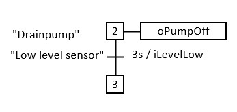
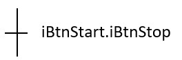
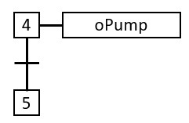
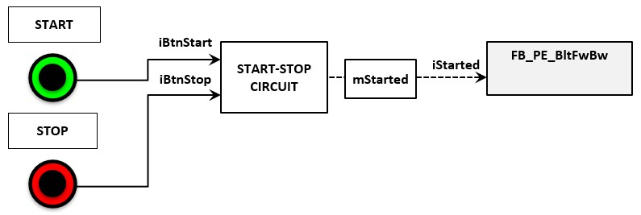
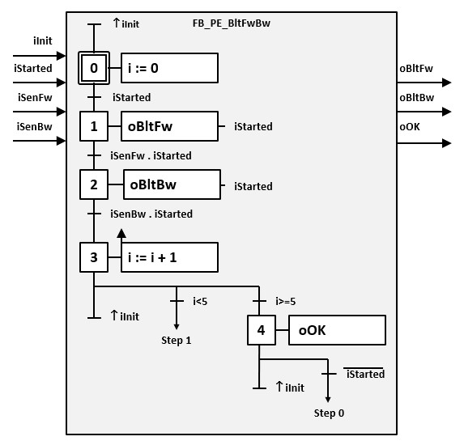
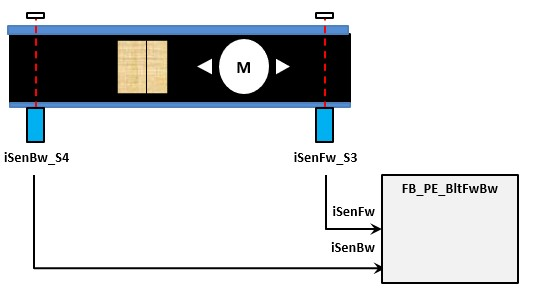
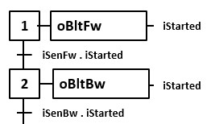
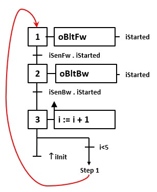

# Designing of a GRAFCET in IEC 60848
## GRAFCET diagram

| **Symbol**| **Description** |
|:---:      |:---             |
| | A GRAFCET diagram is a collection of steps, actions, transitions, connections, etc. which form a complete diagram. The collection of all elements is surrounded by a rectangle. |
| | **Input variables** are on the left with an incoming arrow 

__Example__: "Initial step activation" and "installation started" inputs 
                                                                                                     |
|| **Output variables** are located on the right with an outgoing arrow. 

__Example__: "Forward" and "Backward" output signals.
                                                                                                                         |
|"*" | A **comment** clarifies the working of certain parts and is written between double quotation marks, whereby the asterisk symbol gets replaced by the description.

  __Example__: Stop a drain  pump if the level is too low. 
                                |

## Step
A **step** displays a defined condition of the sequential process. A step is either **Active** or **Not Active**.

On a certain moment during the sequential proces:
-   Is a step active or not active
-   The set of active steps determines the state of the process
-   The GRAFCET determines which step or steps can become active

| **Symbol** | **Descpription** |
| :---:      | :----            |
|       | A **step** is shown as a square with an unique label. For practical reasons the most commonly used label are numbers which replaces the asterisk symbol.

 __Example__: Step 2 
        |
|  | The **initial step** characterizes the initial situation and is displayed as a double square. In case of the initial step being active, all other steps in the GRAFCET won’t be active.

 __Example__: Step 0 

  |
|  | An **enclosed step** means that this step contains other steps. If the conditions after the enclosed step are TRUE, we will proceed to the next step and all internal steps will be inactive.

 It is allowed that an enclosed step contains multiple GRAFCET diagrams, but the enclosed internal steps can only be assigned to one enclosed step. |
|        | An **enclosed initial step** means that this step has multiple internal steps that participate in the initial condition.

 The enclosed initial step contains minimum one internal initial step and can contain multiple GRAFCET diagrams. |
|  | A **macro step** means that this step has multiple internal steps. We can describe it as an independent piece of software. A macro is not designed as standalone software, it’s meant to support a different piece of software. 

 The internal steps always start with a source step and always end with an end step. Only in the case of the end step being active can the macro exit. Unlike an enclosed step, a macro contains a maximum of one GRAFCET diagram and the asterisk symbol gets replaced by one unique label that can deviate from step labels, in numbered order. |
|  |  In case that an **active step** needs to be displayed, this will be done by placing a point under the label.|

## Connections
| **Symbol** | **Description** |
| :---:      | :---            |
|  | Connections are lines in the network that connect steps. |
|  | Both horizontal and vertical lines are allowed. 

Diagonal lines are to be avoided. They are allowed, but only to clarify. |
|  | The flow of a connection is always from top to bottom.

 The use of arrows is allowed in case of clarification. |
|  | If a directed link has to be broken (for example for complex charts or when a chart covers several pages) the number of the destination steps and the number of the page on which it appears, shall be indicated. 

__Example__: Reference to step 12 on page 2

 |

## Transition
| **Symbol** | **Description** |
| :---:      | :---            |
|  | A transition between two steps is indicated by a horizontal line right through the connection line. 

 The transition-condition is active if the previous step is active. 

 Between 2 steps one condition is allowed. |
|  | It’s allowed to use vertical transitions for graphical reasons. |
|  | Each transition contains a condition. This is a mathematical boolean expression composed by variables, they replace the asterisk symbol. The result of a transition-condition is TRUE or FALSE. 

The transition-condition is always at the right of the transition. 

 __Example__: Start button AND stop button 

 |
|  | The transition may have an unique designation ( ) at the left of the transition.

 __Example__: Label 6 

 |
|  | A transition condition that is always TRUE is displayed with the underscored expression 1. |
|  | The status of a step (active or not active) can be added in a transition-condition with the capital letter "X".

 The asterisk symbol will be replaced by a label of the step.

 __Example__: Step variable of step 7 |       |  |
|  | An upward arrow in the transition-condition means that it is only TRUE the moment the variable changes from FALSE to TRUE. 

__Example__: The transition-condition is TRUE on a rising edge of the "Door is Open" sensor OR if the "Door Limit switch" is activated.    |   |   |
| | A downward arrow in the transition-condition means that it is only TRUE the moment the variable changes from TRUE to FALSE.

 __Example__: The transition condition is TRUE on a decreasing flank of the pallet fotocel.

 |
| | A **comparison** is noted between [ ].

 The asterisk symbol gets replaced with a comparison.

  The result of a comparison instruction is TRUE or FALSE. 

__Example__: The transition-condition is TRUE in case the actual pressure is higher than 5,0 bar. 

  |
| | A variable that is time dependent is displayed with the **/** symbols (TON / variable / TOF). 

 Hereby, the transition-condition is TRUE after an on-delay and stays TRUE with an off-delay. It is allowed to simplify the notation by removing the off-delay in case this isn’t used. 

__Example__: The transition condition is TRUE 2 s after the iSen is TRUE  and stays 5s TRUE after iSen becomes FALSE.
  

__Example__: 3 s after step 4 is activated the transition-condition becomes TRUE and step 5 will be activated.

|   |  A **source transition-condition** is a transition-condition without previous steps. Each time the transition condition is TRUE, the next step will be activated. It is recommended to provide a transition condition with a rising or dropping flank to avoid the activation of the next step. 

__Example__:The initialization step 0 will be activated on a rising flank from the initialization input signal.

      |
|   |  An **end transition-condition** is a transition-condition where no steps follows. Each time the transition condition is TRUE, the upwards steps will be disabled.  

__Example__:  Sequence with initialization of a sourcestep where all steps get activated |
  Explanation symbolic image
  -	iInit = digital input – GRAFCET initialise
  -	iStarted = digital input – Result of a start-stop circuit
  -	iSen1 = digital input – Sensor 1
  -	iSen2 = digital input – Sensor 2

## Action
| **Symbol** | **Description** |
| :---:      |:---             |
|  | An **action** is assigned to a step and gets illustrated by a rectangle which is connected to that step with a horizontal line.

 It is allowed to use multiple actions in the same step, if each of them have their own rectangle.

 **Allowed multiple actions:**  |
|  | Each action has an action label which clarifies the executed task.

 The label is written in the rectangle where the asterisk symbol is replaced by a variable.

 A **continue action** will have the status of the variable TRUE the moment the corresponding step is active. All other moments the action is FALSE.

__Example__: The pump action is TRUE on step 4 and FALSE on step 5

  |
|  | A **memory action** has a specific value assigned to a variable which gets stored. The asterisk symbol gets replaced by a variable and the \# symbol gets replaced by a (mathematical) value, formula, .... . 

__Example__: The lamp gets activated in step 7, is still activated in step 8 and turns off in step 9. The internal variable "sX" is increased by 1 in step 8.

  |  | A **conditional action** gets the status TRUE in case of the corresponding step being active and the assigned actioncondition is TRUE. 

__Example:__ The disapproval lamp lights up in case the amount of disapproved parts are bigger then 3 in case step 5 is active.  |
|  | A time dependent **conditional action** is displayed with the / symbols. The action is TRUE after an on-delay and stays TRUE with an off-delay. It is allowed to simplify the condition by removing the off-delay in case this isn't used. 

__Example__: 2s after "iSen" becomes TRUE valve A+ will be activated. 5s after "iSen" become FALSE valve A+ will be deactivated if step 9 is activated. 

__Example__: 3s after step 4 is activated the OK lamp lights up.

 |
|  | It is possible to run a memory action with the activation of a step. This is indicated with an upwards arrow. 

__Example__: With the activation of step 8 the formula will be ran. 

 |  |  | It is possible to run a memory action with the deactivation of a step. This will be shown as a downwards arrow. |   |
Explanation of the used symbols:
-	oPump = digital output – Activation of a pump
-	oLmp = digital output – Activation of a lamp
-	oLmpOK = digital output – Activation of an OK lamp
-	oVlvA_1 = digital output – Activation of Valve A+
-	sX = static variable X
-	sNumNOK = static variable – Amount of NOK parts

## Structures
| **Symbol** | **Description**  |
| :---:      | :-----           |
|  |A **sequence** is a series of steps where each step contains max. one transition-condition.

 The sequence is active if at least one step of the sequence is active. The sequence is inactive when all steps are inactive. |
|  | A simple **loop sequence** is a sequence of steps whereby each step contains max. one transition-condition and where the last step is connected to the first step. |
|  | A **sequence with source step** has a step without previous transition- condition. 

__Example__: Sequence with a initializing sourcestep.

  |
|  | A **sequence with end step** has a step where there are no transition- conditions after it. An end step (and a source step) are necessary with macros. |
|  | It is possible to jump to a step with a **forward sequence skip**.

 Notice that between 2 steps only one transition is allowed. |
|        | It is possible to loop back with a **backwards sequence skip**. This makes it possible to repeat a sequence.

 Notice that between 2 steps only one transition is possible. |
|  | Using a **OR-convergence** makes it possible to choose between different sequences where between 2 steps only one transition is allowed. The designer needs to make sure that both sequences can't be activated at the same time. 

__Example__: In the GRAFCET version A it is possible to activate both step 4 and 5. This can happen when "iSen1" and "iSen2" have the status TRUE and in the moment step 3 is active. In the GRAFCET version B it isn't possible due to the extended transition-condition.

 |
|  | A **AND-convergence** allows to activate parallel sequences at the same time. They will be started after a starting transition.

 An startind AND-convergence is showed by means of a double line after the starting transition.

 Once the parallel sequence is activated both sequences will run seperatly from each other.

 An AND-convergence gets back ends if all the parallel end steps are active and the ending transition-condition is TRUE. An ending AND-convergence is showed by a double line before the ending transition. |

## Function rules
The **function of a GRAFCET** is in general step by step.
If a step is active and the transition condition(s) are met than the next step will be activated. If the next step gets activated the previous step will be deactivated immediately.

It is possible that the status of the different transtion-conditions the fucntion of a GRAFCET seems not to run step by step. It is the task of the designer to avoid that functions which can cause an unstable function of actions.

| **Function** | **Description** |
| :---         | :---            |
|  | A **non transient action**  will run step by step.

 Situation: Step 4 active, iSen1 = iSen2 = Isen3 = FALSE 

 Function: iSen1 (1) is TRUE which activates step 5 and deactivates step 4. |
|  | With a **transient action** the steps won't run step by step.

 Situation Step 4 active, iSen1 = iSen3 = FALSE iSen2 = TRUE 

Function: iSen (1) is TRUE which causes step 5 to be activated and step 4 gets deactivated. Because iSen3 (2) is true, step 6 will inmediatly be activated and step 5 will be deactivated.

 Disadvantage: In case we use an action instead of a memory action, it is possible that the assigned actions of a transient step are not or transient executed (= unstable function).|
|               | An **AND-convergence** parallel sequences will be started in case the previous transition condition is TRUE.

 Situation 1: If step 1 is active and transition conditoin iGestart is TRUE then step 2 and 4 will be activated.   

 Situation 2: Once the parallel sequences are activated they will run separatly.

 Situation 3: Step 9 gets activated in case step 3 and step 6 are active and in case the transition-condition "iSen1.iSen2" is TRUE. |

## Example
The next example shows a GRAFCET for the functionality of a conveyor belt. A box is displaced 5x times from start to end before it stops. After this operation it is necessary to restart the installation.

The GRAFCET has the name FB_PE_BeltFwBw:

-   FB = GRAFCET will be programmed in a function block (FB)
-   PE = This part is a procedure element according ANSI/ISA S88 standard
-   BeltFwBw = Conveyor belt forwards & backwards

The conveyor belt is **started and stopped** by means of a start button and a stop button. The functionality of these buttons is not included in the GRAFCET but gets executed by an external start-stop basic circuit. The result of this start-stop basic circuit will be linked with the GRAFCET input variable "iStarted".

Each time the stop button is pressed the conveyor belt will immediatly stop. When the start button is pressed again, the conveyor and GRAFCET continues where they ended.

The **photocell** sensors on the conveyor belt detects the presence of the box when the infrared beam between photocell and reflector is interrupted. The status of the photocells (%I) is linked with the GRAFCET input variables "iSenFw" and "iSenBw".

Controlling the conveyor belt forwards and backwards will be determined by step 1 and step 2 on condition that the installation is started.

The effective **control of the conveyor belt** happens by the GRAFCET output variables "oBeltFw" and "oBeltBw" which are linked to the contactors (%Q) and the conveyor belt motor (asynchronous motor).

Counting of the **number of backward and forward movements** is controlled by the internal INT variable "i". This variable is an internal function block parameter of the type STATIC. This makes it possible to remember the condition of variable "i" also without voltage (=retentive). 

Increasing the variable "i" is executed in step 3, after which step 1 gets activated because there is a loop sequence between step 3 and step 1 but only if the value of the variable "i" is less than the decimal value 5. Noticed that the increasing of the variable "i" is only executed on the moment that step 3 is activated (rising edge). This is to prevent wrongly increasing the value of the variable in case step 3 is active longer the one PLC cycle.

In case the box went 5x backwards and forward this will be displayed with a green OK lamp. This lamp (%Q) is connected with the GRAFCET output variable "oOk". Now the installation needs to be stopped with the stop button before the installation can restart.

  

It is possible to **initialize** the GRAFCET. This is the activation of the initial step (step 0) by using GRAFCET input variable "iInit". All the other active steps get deactivated. The initialising is only activated on the rising edge of "iInit".

You could choose to initialize the installation in case you press the start and stop button simultaneously for 5 seconds or more.

