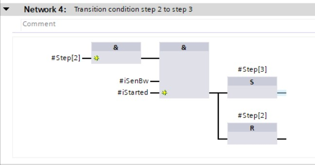
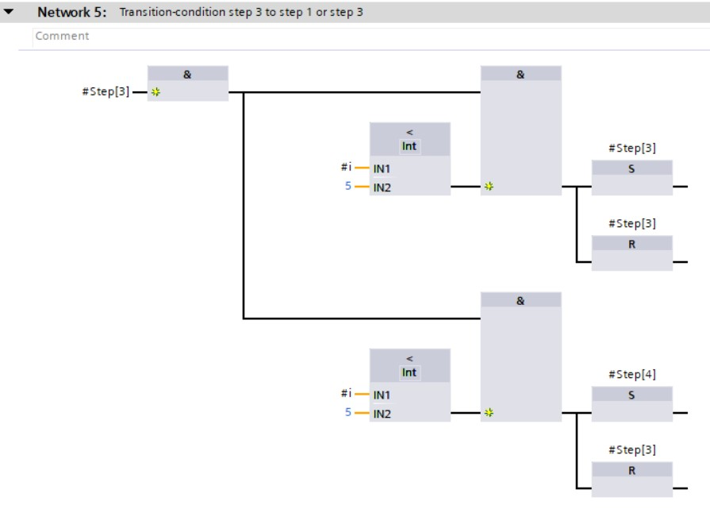

# GRAFCET programmation in LAD/FBD using BOOL

Converting a **GRAFCET design to softwarecode** is demonstrated with the GRAFCET described in subchapter 2.

The GRAFCET is programmed in the LAD orFBD programming language in the function block (%FB) with the use of STATIC parameters. STATIC parameters can remember their status without the PLC being powered on if they are configured as retain.

The programmation is split into **3 parts** which are chronologically programmed in different networks:
-   Initialisation (network 1)
-   Transition-conditions (network 3 ... x)
-   Actions (network x+1 ... last network)

The **GRAFCET programming in LAD/FBD with BOOL** is submitted to the next rules
-   Each step is repesented by an unique BOOL variable
-   This variable is an ARRAY of BOOL starting with 0 and ending with max. step number
-   In case the corresponding variable is TRUE, the step will be active
-   Input "iInit" is always present which causes the activation of the initial step on a rising edge of this input
-   Input "iStarted" is always present which is the result of an external start-stop basic circuit signal that gets send to the GRAFCET

| **Advantages** | **Disadvantages** |
| :---:          | :---:             |
| Simplicity (1 step = 1 variable) | Initial step is not activated during the first download of the program |
|                                | Monitoring of active steps is complicated        |
