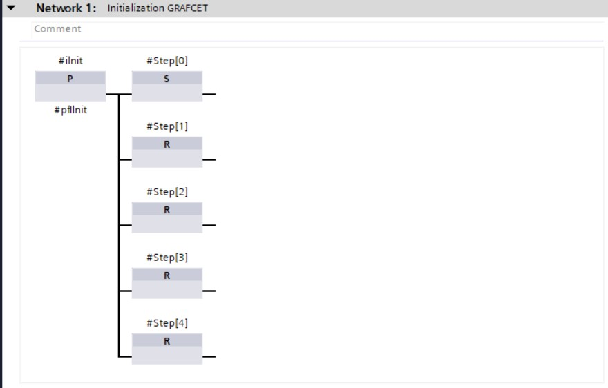

### GRAFCET programmation in LAD/FBD using BOOL

Converting a **GRAFCET design to softwarecode** gets desmostrated with the GRAFCET *Figure 456 : conveyorbelt GRAFCET*.

The GRAFCET gets programmed in the LAD or FBD programminglanguage in the function block (%FB). Hereby can we use STATIC parameters that remeber their status also without voltage (RETAIN)

| **Manufacturer** | **Parameter interface** |
|---------------|-------------------------|
| Siemens       |                         |

Tabel 4118 : Parameter interface - GRAFCET programming in LAD/FBD  BOOL
(Projectdetail in TIA Portal V15 SP1, © 2020
Siemens)

The programmation gets split in **3 parts** which chronologically get programmed in different networks:
-   Initialisation (network 1)
-   Transitionconditions (network 3 ... X)
-   Actions (network x+1 ... last network)

The **GRAFCET prgramming in LAD/FBD with BOOL** variables is build on the ideaoligy

-   Each step has assigned BOOL variables

-   In case this variables is TRUE, the step will be active

-   We use ARRAY whereby the ARRY number is teh same as the GRAFCET step number

-   Initialisations input "iInit" is always present which causes the initial step to be active on a flank signal of this input

-   Input "iGestart" is always present which is the result of the combination start-stop circuit that tells teh GRAFCET its status
| **Manufacturer**  | **Programmation** |
|----------------|-------------------------|
| Siemens (FBD)  |                         |

Tabel 4119 : Initialisation - GRAFCET programmation in LAD/FBD with BOOL
(Projectdetail in TIA Portal V15 SP1, © 2020
Siemens)

| **Manufacturer**  | **Programmation** |
|----------------|-------------------------|
| Siemens (FBD)  |                          |

Tabel 4120 : Transition Conditions - GRAFCET programmation in LAD/FBD using BOOL
(Projectdetail in TIA Portal V15 SP1, © 2020
Siemens)

| **Manufacturer**  | **Programmation** |
|----------------|-------------------------|
| Siemens (FBD)  |                         |

Tabel 4121 : Actions - GRAFCET programmation in FBD using BOOL (Projectdetail in
TIA Portal V15 SP1, © 2020 Siemens)

| **Advantages**                  | **Disadvantages**                                                                         |
|--------------------------------|-------------------------------------------------------------------------------------|
| Simplicity (1 step = 1 variable) | Initial step is not activated during the first download of the program |
|                                | Monitoring of active is more complicated than with other variables        |

Tabel 4122 : Advantages and disadvantages  using GRAFCET programmatie in LAD/FBD using BOOL
