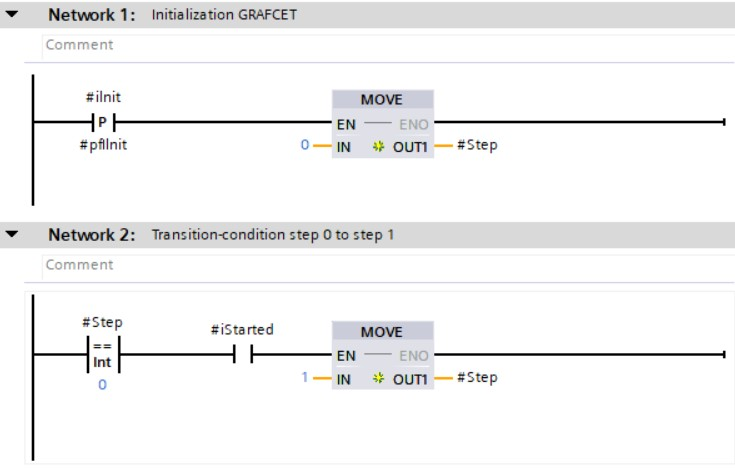

# GRAFCET programmation in LAD/FBD using INT

Converting a **GRAFCET design to softwarecode** is demonstrated with the GRAFCET described in subchapter 2.

The GRAFCET is programmed in the LAD or FBD programming language in the function block (%FB) with the use of STATIC parameters. STATIC parameters can remeber their status also without voltage if they are configured as retain.

The programmation is split into **3 parts** which are chronologically programmed in different networks:
-   Initialisation (network 1)
-   Transition-conditions (network 3 ... x)
-   Actions (network x+1 ... last network)

The **GRAFCET programming in LAD/FBD with INT** is submitted to the next rules
-   Only the actual step needs to be known
-   The actual step is represented by an STATIC INT variable (step)
-   The intial value of this variable is the decimal value 0
-   The actual value of this variable corresponds to the active GRAFCET step
-   The initial step is automatically activated the first time the software is downloaded to the PLC; this because the INT number initial value is equal to the decimal value 0
-   Input "iInit" is always present which causes the activation of the initial step on a rising edge of this input
  - Input "iStarted" is always present which is the result of an external start-stop basic circuit signal that gets send to the GRAFCET

| **Advantages** | **Disadvantages** |
| :---:          | :---:             |
| Initial step is activated during the first download of the program | Complexer, advanced programation then with LAD/FBD BOOL variant |
| Monitoring of active steps is easier | Programmation of AND-convergence is complexer then with LAD/FBD BOOL variant |
