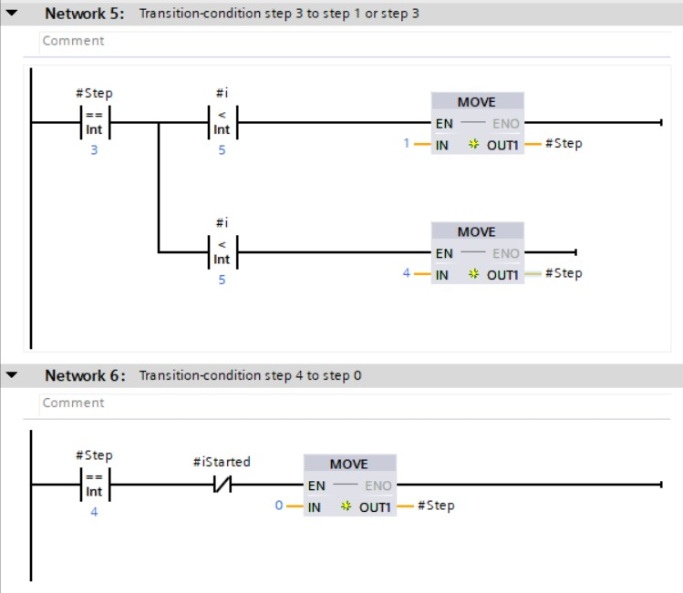

### GRAFCET programmation in LAD/FBD using INT

Converting a **GRAFCET design to softwarecode** gets desmostrated with the GRAFCET *Figure 456 : conveyorbelt GRAFCET*.

The GRAFCET gets programmed in the LAD or FBD programminglanguage in the function block (%FB). Hereby can we use STATIC parameters that remeber their status also without voltage (RETAIN)

| **Manufacturer** | **Parameter interface** |
|---------------|-------------------------|
| Siemens       |                         |

Tabel 4123 : Parameter interface - GRAFCET programmation in LAD/FBD using INT
(Projectdetail in TIA Portal V15 SP1, © 2020
Siemens)

The programmation gets split in **3 parts** which chronologically get programmed in different networks:
-   Initialisation (network 1)
-   Transitionconditions (network 3 ... X)
-   Actions (network x+1 ... last network)

The **GRAFCET prgramming in LAD/FBD with BOOL** variables is build on the ideaoligy

-   Only the acutal step(s) need to be known

-   The actual step(s) as INT nubmer(s) are displayed with one or more variables

-   Incase decimal values of these variable(s) are equal to a GRAFCET stepnumber then the GRAFCET will be active

-   There's always a initialistion input "iInit" that makes it so that the intial step is active on a rising flank signal on this input

-   The initial step is automatically active the first time you do a software download to the PLC; this is because the INT nubmer standard the decimal value 0 has.

-   There's always the input "iGestart" which is the result of the combination start stop circuit which gives info to the GRAFCET

| **Manufacturer**  | **Programmation** |
|----------------|-------------------------|
| Siemens (LAD)  |                         |

Tabel 4124 : Initialisation - GRAFCET programmation in LAD/FBD using INT
(Projectdetail in TIA Portal V15 SP1, © 2020
Siemens)

| **Manufacturer**  | **Programmation** |
|----------------|-------------------------|
| Siemens (LAD)  |                         |

Tabel 4125 : Transitionconditions - GRAFCET programmation in LAD/FBD using INT
(Projectdetail in TIA Portal V15 SP1, © 2020
Siemens)

| **Manufacturer**  | **Programmation** |
|----------------|-------------------------|
| Siemens (LAD)  |                         |

Tabel 4126 : Actions - GRAFCET programmation in LAD/FBD using INT (Projectdetail
in TIA Portal V15 SP1, © 2020 Siemens)

| **Advantages**                                                                  | **Disadvantages**                                                                 |
|--------------------------------------------------------------------------------|-----------------------------------------------------------------------------|
| Initial step is activated during the first download of the program | Complexer, advanced programation then with LAD/FBD BOOL variant         |
| Monitoring of active steps is easier                           | Programmation of AND-Convergence is complexer then with LAD/FBD BOOL variant |

Tabel 4127 : Advantages and disadvantagesGRAFCET programmation in LAD/FBD using INT
