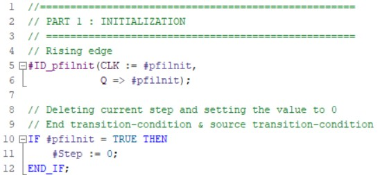
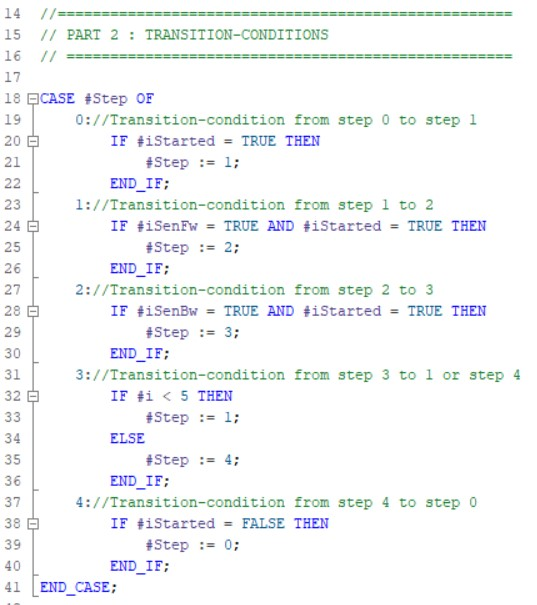

### GRAFCET programmation in ST

Converting a **GRAFCET design to softwarecode** gets desmostrated with the GRAFCET *Figure 456 : conveyorbelt GRAFCET*.

The GRAFCET gets programmed in the ST programminglanguage in the function block (%FB). Hereby we can use STATIC parameters that remeber their status also without voltage (RETAIN)

| **Fabrikant** | **Parameter interface** |
|---------------|-------------------------|
| Siemens       |                         |

Tabel 4128 : Parameter interface - GRAFCET programmation in ST (Projectdetail in
TIA Portal V15 SP1, © 2020 Siemens)

The programmation gets split in **3 parts** which chronologically get programmed in different networks:
-   Initialisation (network 1)
-   Transitionconditions (network 3 ... X)
-   Actions (network x+1 ... last network)

The **GRAFCET prgramming in ST** variables is build on the ideaoligy

-   We use  CASE .. OF .. ELSE control structure which handles the processing of transitionconditions

-   We use INT datatype for displaying the actual step(s), this is because the control structur a ANY_INT datatype requires

-   Incase the decimal value of these variable(s) is equal to a GRAFCET stepnumber then the GRAFCET step is active

-   There's always a initialistion input "iInit" that makes it so that the intial step is active on a rising flank signal on this input

-   The initial step is automatically active the first time you do a software download to the PLC; this is because the INT nubmer standard the decimal value 0 has.

-   There's always the input "iGestart" which is the result of the combination start stop circuit which gives info to the GRAFCET

| **Manufacturer** | **Programmation** |
|---------------|-------------------------|
| Siemens       |                           |

Tabel 4129 : Initialisation - GRAFCET programmatie in ST (Projectdetail in
TIA Portal V15 SP1, © 2020 Siemens)

| **Manufacturer** | **Programmation** |
|---------------|-------------------------|
| Siemens       |                           |

Tabel 4130 : Overgangsvoorwaarden - GRAFCET programmatie in ST (Projectdetail in
TIA Portal V15 SP1, © 2020 Siemens)

| **Manufacturer** | **Programmation** |
|---------------|-------------------------|
| Siemens       |                           |

Tabel 4131 : Actions - GRAFCET programmation in ST (Projectdetail in TIA Portal V15 SP1, © 2020 Siemens)

| **Advantages**                                                                       | **Disadvantages**                                                                 |
|-------------------------------------------------------------------------------------|-----------------------------------------------------------------------------|
| Initial step is not activated while the the first download of the program | Complexer programmation than LAD/FBD variant                             |
| Smaller programmation then LAD/FBD variant                                         | Programmation of AND-Convergence is complexer than the LAD/FBD BOOL variant |
| Monitoring of the active steps are easier                                 | Debugging [^3] in ST is harder than in FBD/LAD                             |

[^3]: Debugging = Searching for (programmation) mistakes

Tabel 4132 : Advantages and disadvantages GRAFCET programmation in ST
