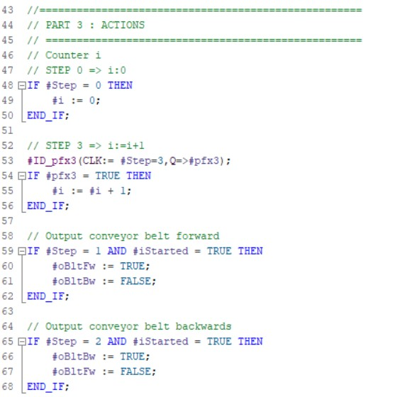

# GRAFCET programming in ST
_____________________________________
Converting a **GRAFCET design to softwarecode** is demonstrated with the GRAFCET described in subchapter 2.

The GRAFCET is programmed in the LAD or FBD programming language in the function block (%FB) with the use of STATIC parameters. STATIC parameters can remeber their status also without voltage if they are configured as retain. 

The programming is split into **3 parts** which are chronologically programmed in different networks:
-   Initialisation (network 1)
-   Transition-conditions (network 3 ... x)
-   Actions (network x+1 ... last network)

The **GRAFCET prgramming in ST** is submitted to the next rules
-   The use of CASE .. OF .. ELSE control structure which handles the processing of transition-conditions
-   Only the actual step needs to be known
-   The actual step is represented by a STATIC ANY_INT variable (step)
-   The initial value of this variable is the decimal value 0
-   The actual value of this variable corresponds to the active GRAFCET step
-   The initial step is automatically activated the first time the software is downloaded to the PLC; this because the INT number initial value is equal to the decimal value 0
-   Input "iInit" is always present which causes the activation of the initial step on a rising edge of this input
-   Input "iStarted" is always present which processes the result of an external start-stop basic circuit

| **Advantages**| **Disadvantages** |
| :---: | :---: |
| Initial step is not activated while the the first download of the program | More complex programming than LAD/FBD variant |
| Smaller programming then LAD/FBD variant | Programming of AND-convergence is more complex than the LAD/FBD BOOL method |
| Monitoring of active steps are easier | Debugging [^3] in ST is harder than in FBD/LAD |

[^3]: Debugging = Searching for (programming) faults
