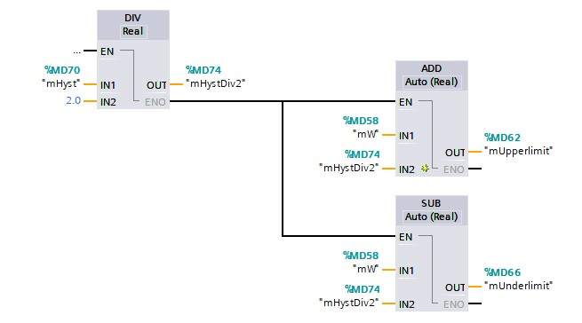
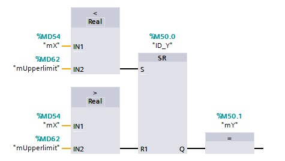
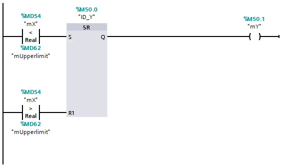

## On-off circuit
The **on-off circuit** gets used to switch a control output Y [BOOL] on or off in function of a measured value X [REAL] and a set value W [REAL]. The on-off switch ensures that the actuator does not switch on and off too often by using 2 threshold values, namely:
- The switch-on threshold value (lower limit)
- The switch-off threshold value (upper limit)

The difference between the switch-on and switch-off threshold values becomes the so
called hysteresis. The following mathematical formulas apply:

Switch-on threshold or lower limit = X -  Hysteresis/2.0
Switch-off threshold or upper limit = X +  Hysteresis/2.0

 **FBD**
 

 **LD**
 

In case the process value is lower then the switch-on threshold, the loop manipulated value will be turn off.
As soon as the process value reaches the switch-off threshold, the loop manipulated value will be turn off.

**FBD**

**LD**

 **Example on-off switch - Heating in a home**
  Homes are often equipped with a thermostat to measure and control the temperature in a room.
  - The thermostat measures the room temperature = measured value X
  - The ideal temperature is entered on the thermostat = desired value W
  - If it is too cold, the thermostat ensures that the boiler is switched on = closed contact = control output Y on
  - If it is too hot, the thermostat ensures that the boiler is switched off = open contact = control output Y off
  - Depending on the type of thermostat, the hysteresis is a fixed value or adjustable (order of magnitude 0.5 to 1.0 ° C)
