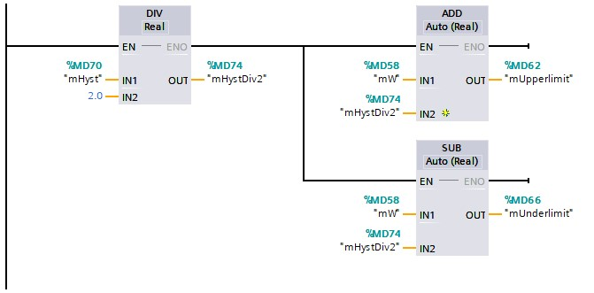

## On-off circuit
The **on-off circuit**[^1] gets used to switch a control output Y [BOOL] on or off in function of a measured value X [REAL] and a set value W [REAL]. The on-off switch ensures that the actuator does not switch on and off too often by using 2 threshold values, namely:
- The switch-on threshold value (lower limit)
- The switch-off threshold value (upper limit)

The difference between the switch-on and switch-off threshold values becomes the
called hysteresis. The following mathematical formulas apply:

Switch-on threshold or lowerlimit = X -  Hysteresis/2.0
Switch-off threshold or upperlimit = X +  Hysteresis/2.0

| **Fabrikant** | **FBD** |
|---------------|---------|
| Siemens       |         |

Tabel 4101 : Preparing calculations for FBD ON-OFF circuit in TIA Portal V15 SP1, © 2020 Siemens

| **Fabrikant** | **LD** |
|---------------|--------|
| Siemens       |        |

Tabel 4102 : Perparing calculations for LD on-off circuit in TIA Portal V15 SP1, © 2020 Siemens

Indien de gemeten waarde lager is dan de inschakeldrempel zal de regeluitgang
worden ingeschakeld. Van zodra de uitschakeldrempel wordt bereikt zal de
regeluitgang worden uitgeschakeld.

| **Fabrikant** | **FBD** |
|---------------|---------|
| Siemens       |         |

Tabel 4103 : FBD on-off circuit in TIA Portal
V15 SP1, © 2020 Siemens

| **Fabrikant** | **LD** |
|---------------|--------|
| Siemens       |        |

Tabel 4104 : LD on-off ciruit in TIA Portal
V15 SP1, © 2020 Siemens

 **Example on-off switch - Heating in a home**
  Homes are often equipped with a thermostat to measure and control the temperature in a room.
  - The thermostat measures the room temperature = measured value X The ideal temperature is entered on the thermostat = desired value W
  - If it is too cold, the thermostat ensures that the boiler is switched on = closed contact = control output Y on
  - If it is too hot, the thermostat ensure that the boiler is switched off = open contact = control output Y off
  - Depending on the type of thermostat, the hysteresis is a fixed value or adjustable (order of magnitude 0.5 to 1.0 ° C) 
