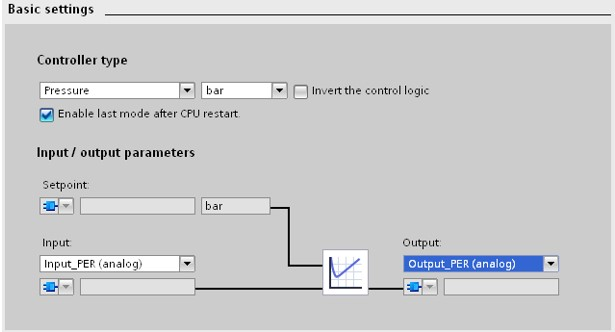
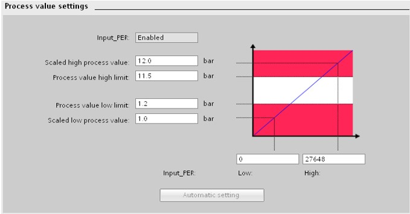
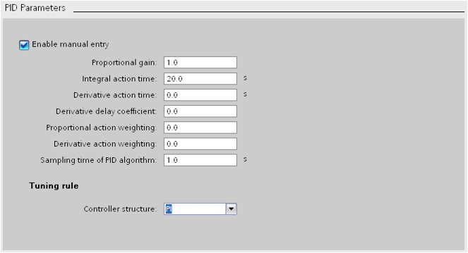
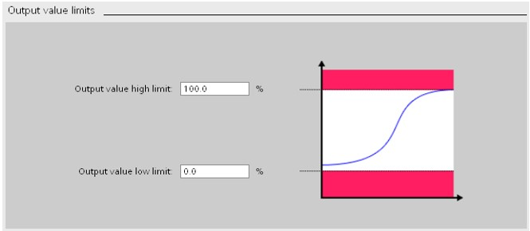
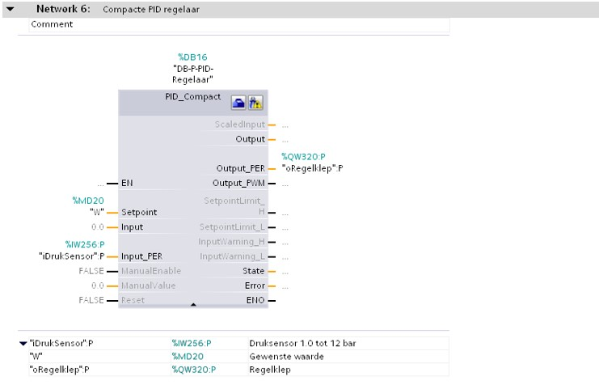
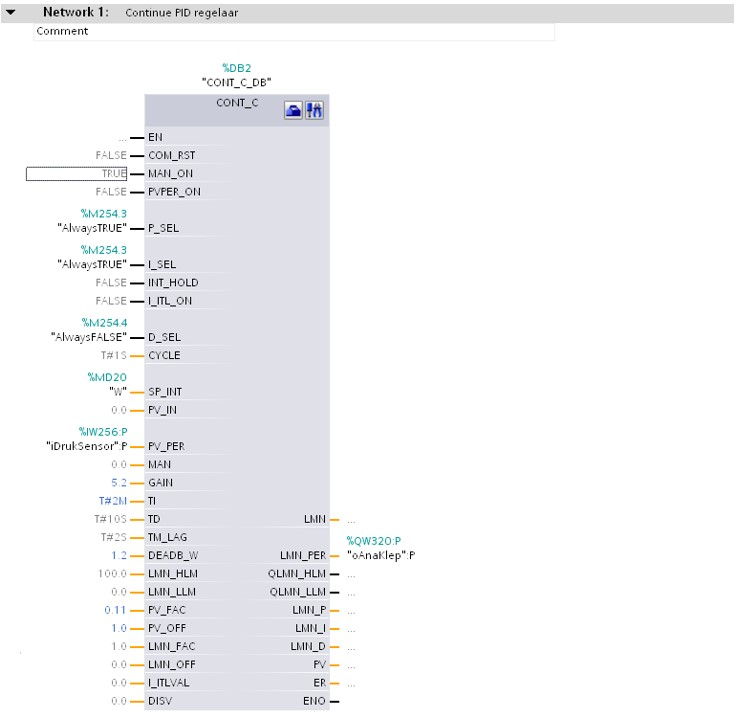

## PID controller

### Functioning

A PID controller is used to control processes via an analog actuator
[Y = INT or WORD]. A PID controller consists of several sub-functions. So
one distinguishes:

- P or Proportional action

- I or Integrative action

- D or Differentiating action

### Compact PID controller

The compact Siemens PID controller is limited compared to the continuous PID controller
its possibilities. Most of the parameters can be set via
associated pop-up menus and can therefore only be set using a
programming device (PC with TIA Portal).

As an advantage it can be cited that configuring this controller is done by
using these pop-up screens which is much easier. This way one can make a choice
between the different quantities and different SI units and one can
opt to operate via a normalized input (output) or a periphery
entrance exit).

If you opt for a peripheral input, you can convert it to the
correct measuring range using the screen *“Process value settings”*.

The P, I and D action can be set via the screen *“PID Parameters”*. Notice
that the different actions cannot be selected individually. One can only
make a choice between a PID and a PI controller. Note that every action is separately correctable. For example, one can calculate the weight of the P action and the
D-action can be individually adjusted to even turn off and one can
assign a wait coefficient for the D action.

The output can be limited just like a continue controller. This can be done in the *"Output value limits"* screen.

Because of the different parameters being adjustable by using pop-up screens will the PID building block be compacter than the continue Siemens PID controller.

### Programmation example – Continue PID controller

In the programation example below will you find the programation of a continue PID controller.

The analog pressuresensor %IW256 gets formed internally so that the following results are obtained:

-   PV_NORM = (output CRP_IN) . PV_FAC + PV_OFF

-   PV_NORM = (output CRP_IN) . 0,11 + 1.0

-   1.0 bar = ( 0%) . 0,11 + 1.0

-   12.0 bar = (100%) . 0,11 + 1.0

The loop manipulated value is variable adjstable suing %MD20. This way we can adjust the loop manipulated value with changing the userprogram.

The dead band is adjustable at 1.2 bar. In case (W - XDo/2) \< X \< (W + XDo /2)
The output of the controller doesn't change.

The controller is adjustable so that:

-   The P-action is activated and the gain is set to 5.2

-   The I-action is activated and the resettime is set to 2 min.

-   The D-action is deactivated

The output is limited between 0 and 100+ (standard settings) and transformed to the peripheral output %PQW320.

Notice that the values are shown in light grey colour which are the standard values.

| **The PID buildblock gets saved by TIA PORTAL in the folder“Program Blocks\\System Blocks\\Program Resources”** |
|------------------------------------------------------------------------------------------|

