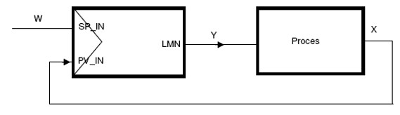
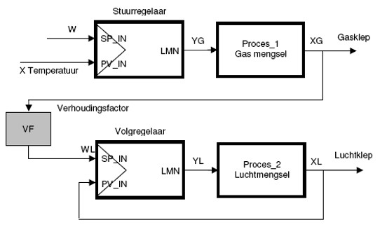
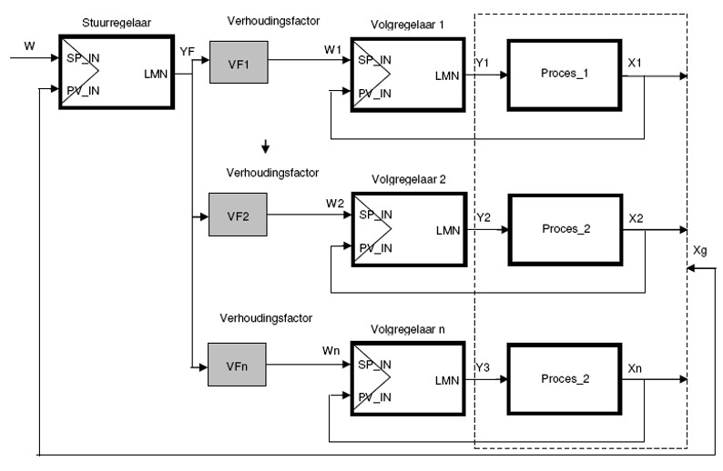
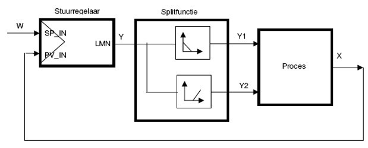

## controllerciruit structuring

### Singular controlcircuit

This is the simplest controlcircuit. The controller keeps the controlled unit [X] stable on the set value [W]

Figuur 1220 : Singular controlcircuit

Singular feedback controlcircuits get used there where the influence on the controldynamic and the controlresult minor is.

### Cascadecontroller or master/slave controller

The imperfections of a single control loop are mainly improved by a cascade control. In cascade control, the control loop becomesdivided into a main control loop and an auxiliary control loop.
For this there is at least one main or control controller (master) and one auxiliary orfollower control (slave) required.
- The main or control controller regulates the main control variable to the desired one  value [W]
- The main or control controller returns an analog SI unit [Yf]  which is processed by the auxiliary or follow-up controller as the desired value  [Yf = Wh]
- The result of the auxiliary or tracking controller [Yh] influences the process of the  analog measurement of the main or control controller

Figuur 1221 : Cascade controller

Depending on the needs can a cascadecontroller be equipped with multiple help controllers. Consequently you could place multiple help/follow controllers behind a head controller.

### Ratio controller

The ratio controller has just like a cascade controller a head controller and a help- or follow controller. The intention is to have multiple prcesunits in a constant ratio. The ratio controller gets used mostly for controlling 2 flow streams, between these 2 need to be a determined ratio.

The simplest example of a ratio controller is for example the gas and airsupuply in a gas incinerator. The head controller controls the amount of gas, depending on the desired oven temperature. The help or follow controller gets controlled by the actual value of the head controller which then controls on his turn the amount of air.

Figuur 1222 : Ratio Controller

The ratio between both SI units, gas and air gets used with a ratio factor on the setpoint for the control or follow controller.

### Mix Ratio Controller

A mix ratio controller is a ratio controller with a main controller and several subordinate auxiliary or follow-up controllers.

With the mixing ratio control it is possible to make a product from several basic components consists of mixing [X1, X2,… .Xn] into a final product with a constant mixing ratio.

The main or control controller controls the joint composition [Xg] with which it controls all subordinate component controllers with its control output [Yf]. It percentage share of each component [X1, X2 ..Xn] with respect to thejoint mixing ratio [Xg] is entered with the ratio factor for.

Figuur 1223 : Mix ratio controller

### Split range controller

Some applications need multiple ajustment ratio's then gets achieved with only one adjusting device, example a controlvalve.

A split range controller is a controller with one controlling SI unit and multiple controlled SI units.

The controlling unit divides her actions over for example two adjustment devices.

Split range controllers get used a lot in systems for heating and cooling.

It is also useful for applications  in case the controlled variable varies over a big range.

Figuur 1224 : Split range controller

The controlleroutput gets split in parallel paths, each with a adjusting device.
