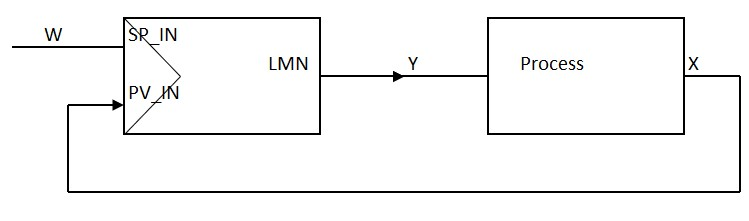
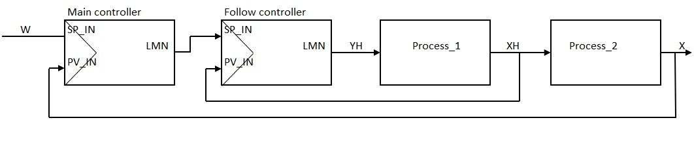
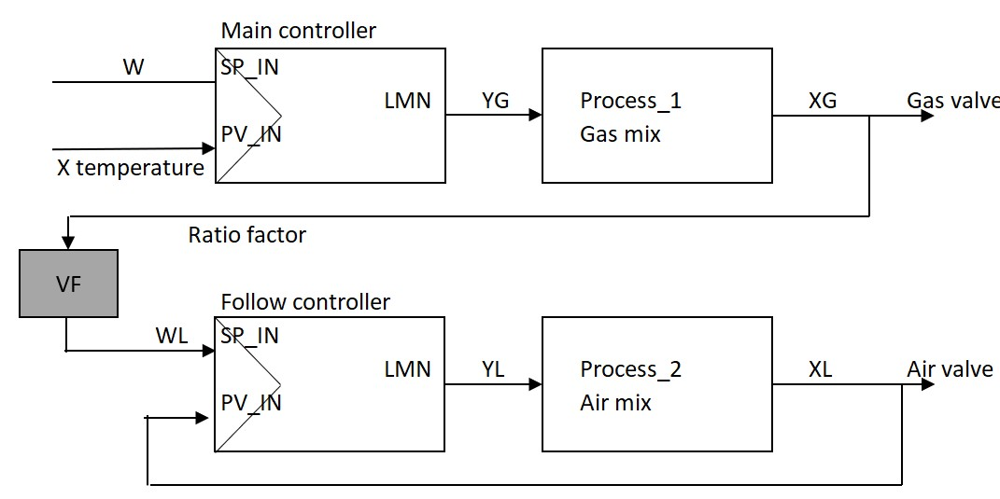
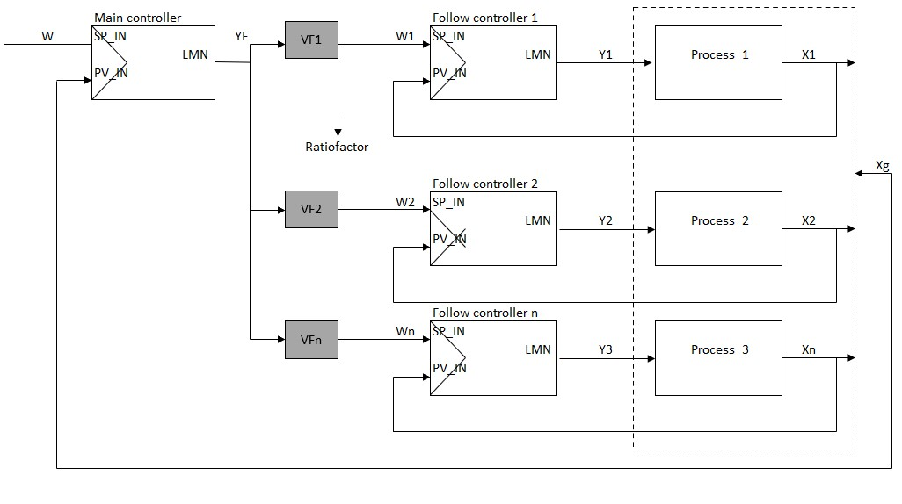
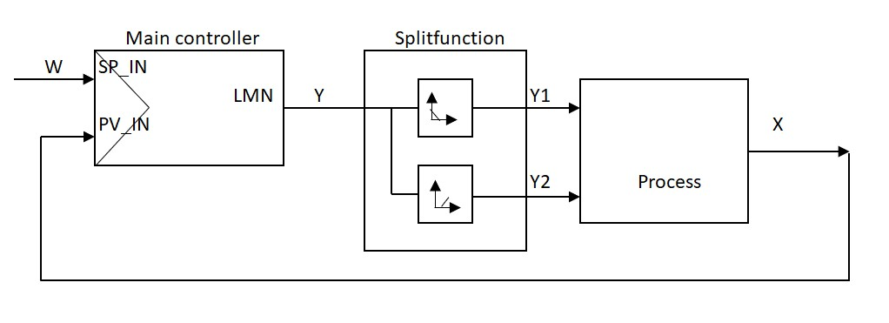

## Controller circuit structuring

### Singular control circuit

This is the simplest control circuit. The controller keeps the controlled unit [X] stable on the set value [W]

Singular feedback control circuits are commonly used where the influence of the controldynamic and the control result are minor.

### Cascade controller or master/slave controller

The imperfections of a single control loop are mainly improved by a cascade control. In cascade control, the control loop becomes divided into a main control loop and an auxiliary control loop.
For this there is at least one main control controller (master) and one auxiliary or follower control (slave) required.
- The main or control controller regulates the main control variable to the desired one  value [W]
- The main or control controller returns an analog SI unit [Yf]  which is processed by the auxiliary or follow-up controller as the desired value  [Yf = Wh]
- The result of the auxiliary or tracking controller [Yh] influences the process of the  analog measurement of the main or control controller

Depending on the needs a cascade controller can be equipped with multiple help controllers. Consequently you could place multiple help/follow controllers behind a head controller.

### Ratio controller

The ratio controller has just like a cascade controller a head controller and a help- or follow controller. The intention is to have multiple processunits in a constant ratio. The ratio controller gets used mostly for controlling 2 flow streams, between these 2 flow streams a determined ratio needs to be present.

The simplest example of a ratio controller is for example the gas and air supply in a gas incinerator. The head controller controls the amount of gas, depending on the desired oven temperature. The help or follow controller gets controlled by the actual value of the head controller which then controls the amount of air.

The ratio between both SI units, gas and air gets used with a ratio factor on the setpoint for the control or follow controller.

### Mix Ratio Controller

A mix ratio controller is a ratio controller with a main controller and several subordinate auxiliary or follow-up controllers.

With the mixing ratio control it is possible to make a product from several basic components consists of mixing [X1, X2,… .Xn] into a final product with a constant mixing ratio.

The main- or control-controller controls the joint composition [Xg] it controls all subordinate component controllers with its control output [Yf].The percentage share of each component [X1, X2 ..Xn] with respect to the joint mixing ratio [Xg] is entered with the ratio factor "for".

### Split range controller

Some applications need multiple ajustment ratios, that can be achieved with only one adjusting device, for example a controlvalve.

A split range controller is a controller with one controlling SI unit and multiple controlled SI units.

The controlling unit divides its actions over for example two adjustment devices.

Split range controllers get used a lot in systems for heating and cooling.

In case the controlled variable varies over a big range, will it be useful for applications.

The controller output gets split in parallel paths, each with an adjusting device.
