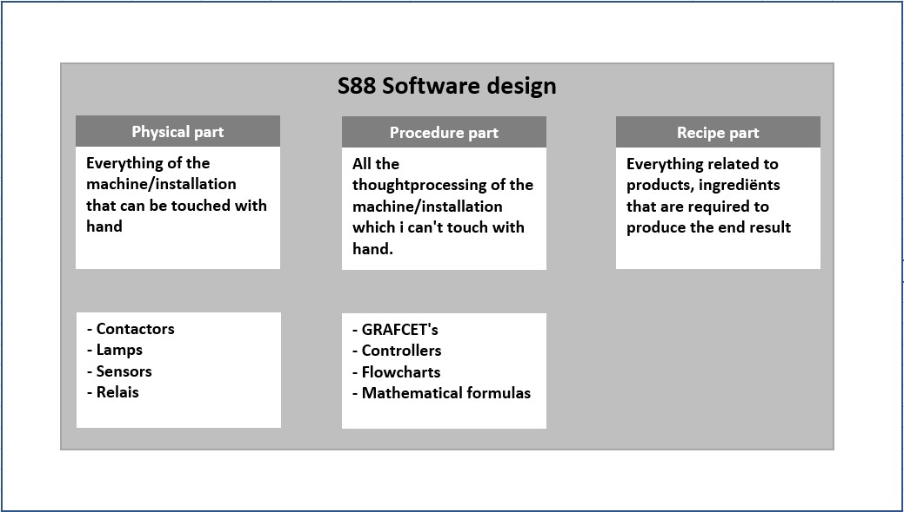
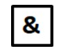
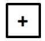
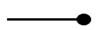
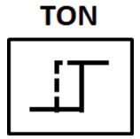
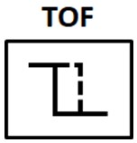
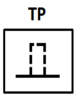
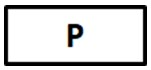
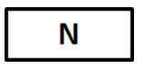

# Software model ANSI/ISA-88
_____________________________________
## The different parts
The ANSI/ISA-88 norm or the **S88 software model** is a norm that describes how a machine/installation (batch)process can be subdivided in different parts.

The advantage of this is that one big problem[^1] will be divided in different smaller partial problems; smaller problems are often easier to solve than bigger problems. A strategy will be developed for each small partial problem that will cause the bigger problems to be solved one by one.

[^1]: Within (process)automation this is commonly the automation of an entire machine/installation.
The S88 software model divides a machine/installation proces in 3 big parts:
-   The physical part
-   The procedure part
-   The recipe part

Because the S88 software model is very abstract and expanded we will be using a very simple form in this course:
-   The back spine is the physical part
-   The procedure part gets integrated in the physical part.
-   The recipe part won't be applied

This means that the software building blocks only get designed for the processing of the physic part or only the procedure part.
The building blocks will exhange information between each other.

The following chapters describe different building blocks that are included in the software library. The operation of each individual building block is explained with the use of a operation scheme with the following symbols:

| **Symbol** | **Description**                                                                                                             |
|-------------|------------------------------------------------------------------------------------------------------------------------------|
|             | AND port                                                                                                                    |
|             | OR Port                                                                                                                     |
|             | NOT connection                                                                                                               |
|             | Connection                                                                                                                   |
|             | Risedelay                                                                                                              |
|             | Drop-off delay                                                                                                             |
|             | Time Puls                                                                                                                     |
|             | A collection of instructions that together a combination basiccircuit form (in this case the start-stop circuit)  |
|             | Positive flank signal                                                                                                       |
|             | Negative flank signal                                                                                                       |

The operation scheme gets drawn up so that every incoming signal is as far to the left as possible and all output signals are to the right. Connections are when needed drawn with dotted lines (with crossing lines) to avoid confusion.

# Physical part - Control modules
**Control modules** are software blocks that
  - Process sensor input singals (%I)
  - Activate / control output signals (%Q)

This way a control module gets represented by a certain type of actuator or sensor and by preference gets included in the software library.
Control modules are preferably progammed in "Function buildblocks" whereby, the TAG-naming gets expanded with the letters CM.

_Examples_
| Tag | Processing of a digital sensor  |
|--|---|
| FB_CM_DI_Sensor |  Processing of a digital sensor |
| FB_CM_AI_Sensor | Processing of an analog sensor |
| FB_CM_DOL	| Controlling an asynchronous motor with 1 speed and 1 rotating direction   |
| FB_CM_DOLRev	   | Controlling an asynchronous motor with 1 speed and 2 rotating directions    |
| FB_CM_Valve   | Controlling of a (pressurised air) valve  |
| FB_CM_Relay   | Controlling of a relay |
| FB_CM_Lamp  | Controlling of a (LED) lamp  |
