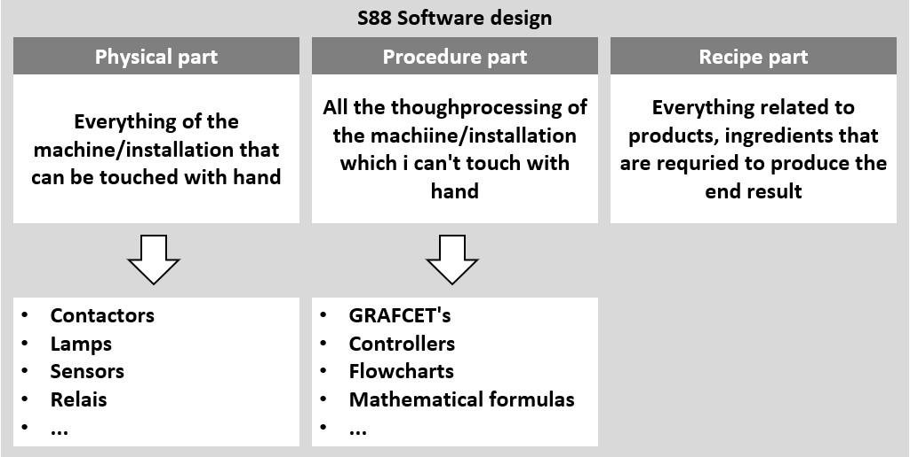

# Software model ANSI/ISA-88
_____________________________________
## The different parts
The ANSI/ISA-88 standard or the **S88 software model** is a standard that describes how a machines and technical installations can be subdivided in different parts.

The advantage of this is that one big automation problem[^1] will be divided in different smaller partial problems; smaller problems are often easier to solve than a bigger problem. A strategy will be developed for each small partial problem that will cause the bigger problems to be solved one by one.

[^1]: Within (process)automation this is commonly the automation of an entire machine or technical installation.
The S88 software model divides a machine or technical installation in 3 main parts:
-   The physical part
-   The procedure part
-   The recipe part

Because the model is very abstract we will focus a very simple form in this course:
-   The physical part is used as a core element
-   The procedure parts are integrated into the physical part
-   The recipe part won't be applied

The following chapters describe different blocks that are included into a software library.
A library that contains software blocks who are often used in PLC programs. The operation of each block is explained with the use of a operation scheme with the following symbols:

| **Symbol** | **Description**                                                                                                             |
|-------------|------------------------------------------------------------------------------------------------------------------------------|
|             | AND port                                                                                                                    |
|             | OR Port                                                                                                                     |
|             | NOT connection                                                                                                               |
|             | Connection                                                                                                                   |
|             | Risedelay                                                                                                              |
|             | Drop-off delay                                                                                                             |
|             | Time Puls                                                                                                                     |
|             | A collection of instructions that together a combination basiccircuit form (in this case the start-stop circuit)  |
|             | Positive flank signal                                                                                                       |
|             | Negative flank signal                                                                                                       |
The operation scheme gets drawn up so that every incoming signal is as far to the left as possible and all output signals are to the right. Connections are when needed drawn with dotted lines (with crossing lines) to avoid confusion.

# Physical part - Control modules
**Control modules** are software blocks that
  - Process sensor input signals (%I)
  - Control output signals (%Q)

In this way a control module represent a certain actuator or sensor and gets included in the software library.
Control modules are preferably progammed in "Function blocks (FB)" whereby, the TAG-naming gets expanded with the letters CM.

_Examples_

| Tag | Description  |
|--|---|
| FB_CM_DI_Sensor |  Processing of a digital sensor |
| FB_CM_AI_Sensor | Processing of an analog sensor |
| FB_CM_DOL	| Controlling an asynchronous motor with fixed speed and 1 direction   |
| FB_CM_DOLRev	   | Controlling an asynchronous motor with 1 speed and 2 directions    |
| FB_CM_Valve   | Controlling of a (air) valve  |
| FB_CM_Relay   | Controlling of a relay |
| FB_CM_Lamp  | Controlling of a (LED) lamp  |
