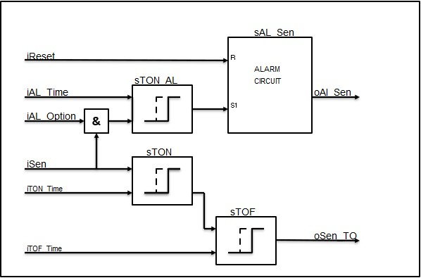

# Digital sensor
A **digital sensor** (Ex.:limit switch, inductive sensor, capacitive sensor, tuning fork,...) processes mainly the presence of a product, object, person, etc. It has 2 conditions which indicate wether these products, objects or persons are preset or not.

Functionally seen these sensors monitor:
- The correct automatic process wether or not with the needed delay (example, opening of a door with the help of a photcell after which the door stays open for a bit)
- The protection against defects (example, overflow protection )

One can design a buildblock wherein all the above functionalities are processed. As a Consequently, this buildblock is the software repesentative of a digital sensor.

This buildblock belongs to the grop of **control modules** are provided with following functionalities:
-  The module will ensure that the sensor signal (iSen) wether or not delayed with a on-delay(iTON_Time) and/or a off-delay (iTOF_Time) for a correct operation, which then provides the output signal (oSen_TO)
- In case the option alarm (iAL_Option) is enabled, the module will activate an alarm(ioAL_Sen) as soon as the sensor (iSen) is disabled. Taking into account the off-delay(iAL_Time).
- If the sensor(iSen) isn't switched on anymore, the module will tur off the alarm(ioAL_Sen) as soon as it gets reset(iReset)

It is possible with the description to draft a operation scheme for the control module with the name FB_CM_DI_Sensor.

This results into a "Function buildblock" which looks like the following images.
| Text | Image |
| --|---|
| FDB example  |   |
| More simple example  |   |
