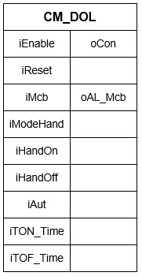
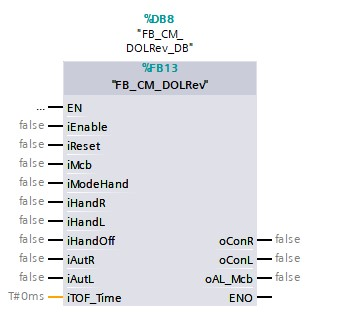
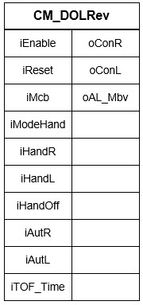

# Asynchronous motors
## Asynchronous motor with set speed and one turn direction

With the current technology an asynchronous motor that only runs forward with a set speed can't operate without:
- 1x motor circuit breaker
- 1x relay

A **control module** for this type actuator is inseperable connected with a motor circuit breaker and a relay. The control module shortly does the following:
- If the think process(iAut) asks that if the motor needs to run, the control module will let the motor run (oCon)
- But if the motor circuit breaker (iMcb) is turned off the module won't let the motor run en it'll activate the alarm (ioAL_Mcb)
- The motor will only start running again if the motor circuit breaker has been activated and the alarm reset has been reset(iReset)

One can expand the functionalities of the control module:
- The motor will only run (oCon) if the module is enable (iEnable)
- If manual mode is activated (iModeHand), the module will ignore the request from the think process (iAut) and runs the motor whenever the manual signals are given (iHandOn & iHandOut)
- If the motor needs to run (oCon) the module can start the motor with an on delay (iTON_Time) and/or an off delay(iTOF_Time)

It is possible with the description to draft an operation scheme for the control module with the name FB_CM_DOL.

The end result is a **"Function building block"** which looks like the following images.

| Text | Image |
| :--: | :---: |
| FDB example  |   |
| More simple example  |   |

## Asynchronous motor with set speed and two turn directions

With the current technology an asynchronous motor that runs forward and backwards with a set speed can't operate without:
- 1x motor circuit breaker
- 2x relays

A **control module** for this type of actuator is inseperably connected with a motor circuit breaker and a relay. The control module, in short does the following:
- If the think process(iAutL) asks if the motor needs to run left, the control module will let the motor run left (oConL)
- If the think process(iAutR) asks if the motor needs to run right, the control module will let the motor run right (oConR)
- It is possible to run through a waiting time(iTOF_Time) if it is requested to change direction
- But if both directions are requested (left and right) the direction doesn't change and the motor will keep spinning the way it was before the request.
- But if the motor circuit breaker (iMcb) is turned off the module won't let the motor run en it'll activate the alarm (ioAL_Mcb)
- The motor will only start running again if the motor circuit breaker has been activated and the alarm reset has been reset(iReset)

One can expand the functionalities of the control module:
- The motor will only run (oConR & oConL) if the module is enable (iEnable)
- If manual mode is activated (iModeHand), the module will ignore the request from the think process (iAutR & iAutL) and runs the motor to the right(oConR) whenever the manual signal is given (iHandR)
- If manual mode is activated (iModeHand), the module will ignore the request from the think process (iAutR & iAutL) and runs the motor to the left(oConL) whenever the manual signal is given (iHandL)
- The control module won't change running condition if the mode changes from automatic mode (NOT iModeHand) to hand mode (iModeHand)

It is possible with the description to draft an operation scheme for the control module with the name FB_CM_DOLRev

The end result is a **"Function building block"** which looks like the following images.

| Text |Image |
| :---:   | :---:  |
| FDB example  |   |
| More simple example  |   |
