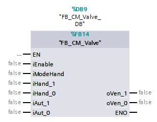

## Valves

A valve is used to power compressed air or hydraulic actuators (ex. compressed air cylinder). The combination of a valve and actuator has a specific functionality:
- Monostable power circuit: In case there is a loss of power the actuator will automatically take its residual state (ex. single-acting compressed air cylinder)
- Bistable power circuit: In case there is a loss of power the actuator will keep the last position (ex. double-acting compressed air cylinder)
- Monostable control circuit:  In case there is a loss of power in the control circuit the valve will automatically take its residual state (ex. 3/2 valve with spring return)
- Bistable control circuit: In case there is a loss of power in the control circuit the valve will automatically keep its last state (ex. 5/2 valve with electromagnetic control on both sides)

A **control module** for a valve will be built without taking into account the already existing functions of the combination valve - actuator. The control module will work following the bistable process.

**Why would you use a monostable valve and cylinder?**

During the design of a machine/installation one needs to ask themselves: What can go wrong during an unexpected event? How do i take care of potential risk to a human? Following the machine guidelines, no moving part of the machine or no single object that is held by the machine can be dropped or ejected. (2006/42/EG,2006)

Unexpected events like for example a fire, an accident, an earthquake, a flood, etc. can cause interruptions in the control- and/or power circuits. The interruption of these circuits can cause dangerous situations.

_Example_

Because of a fire in a technical room, the air compressor stopped working which has the side effect that there is no more compressed air. A robot that moves part of +/- 2 kg on highspeed is equipped with a pneumatic grabber. There is the danger that in case the compressed air falls away on the moment the robot moves at high speed, that the robot lets go of the object and basically throws away the object. This has the potential to hurt humans that work near the robot.

In this situation one chooses a monostable compressed air cylinder with a spring return, this will keep the grabber "grijper" to remain closed in case the compressed air falls away.

The functionality of this type control module:
- The control module will work on the following a bistable principle;
-  - In case the think process asks to activate the "+" side of the valve (iAut_1) the control module will do this (oVlv_1) and it will keep the condition in case the think process doesn't ask for it anymore, until the "-" side gets activated
-  - In case the thinkprocess asks to activate the "-" side of the valve (iAut_0) the control module will do this (oVlv_0) and it will keep the condition in case the think process doesn't ask for it anymore, until the "+" side gets activated
- The control module will only change the condition of the electromagnetic control in case this is allowed (iEnable)
- If the hand mode is active (iModeHand) the control module ignores the think process signals (iAut_1 & iAut_0) and sends the valve (oVlv_1 & oVlv_0) commands based off the hand signals (iHand_1 & iHand_0)

It is possible with the description to draft a operation scheme for the control module with the name FB_CM_Valve

The endresult is a **"Function buildblock"** which looks like the following images.

| Text |Image |
| :---:      | :----:            |
| FDB example  |   |
| More simple example  |   |

## Relay

A **relay** is often used to build up communication with:
- Other PLC's via a potential-free contacts
- Other devices like frequency controllers

Just like an asynchronous motor one can assign multiple functionalities to the corresponding control module such as:
- If the think process asks to activate the relay (iAut), the relay will be activated (oRel)
- The relay will only be activated if this is enabled (iEnable)
- If hand mode (iModeHand) is activated then the module will ignore the think process's signal (iAut) and activates the relay based on the hand signals
- If it's asked to activate the relay, the module has the possibility to activate a rise delay (iTON_Time) and/or drop-out delay (iTOF_Time)

It is possible with the description to draft an operation scheme for the control module with the name FB_CM_Relay

The end result is a **"Function building block"** which looks like the following images.

| Text |Image |
| :---:      | :---:            |
| FDB example  |   |
| More simple example  |   |

## Lamp

A **lamp** is used to inform an operator about the status of a machine/installation or part of it.

A lamp control module handles following functionalities:
- Continued lighting of the lamp (iAut)
- Blinking of the lamp (iAaut_1Hz)
- Fast blinking of the lamp (iAut_2Hz)
- Activating the lamp if a lamp test(= controlling the lamps on defective lamps by maintenance technicians) is being executed (iHandTest)

It is possible with the description to draft an operation scheme for the control module with the name FB_CM_Lamp

The end result is a **"Function building block"** which looks like the following images.

| Text |Image |
| :---:      | :---:            |
| FDB example  |   |
| More simple example  |   |
