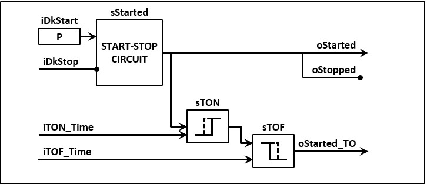
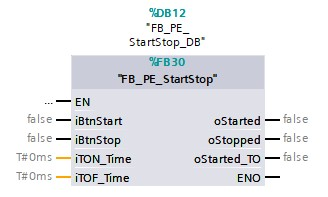
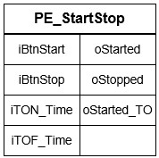
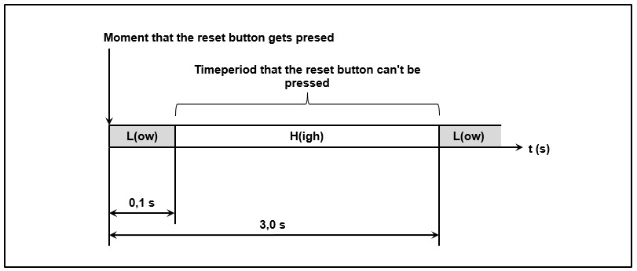
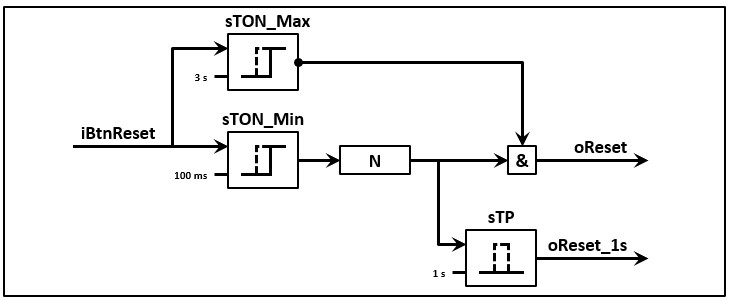
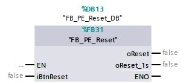
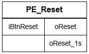
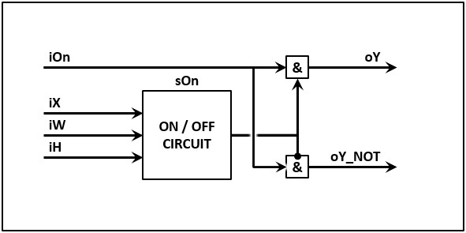
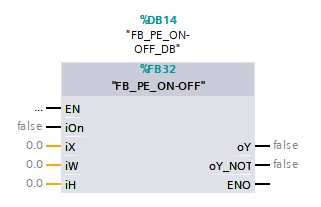
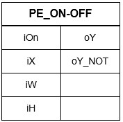

# Physical part
## Equipment modules

An **equipment module** is a collection of multiple control modules and/or other equipment modules. The collection is built upon the physical relationship they have with each other.
In other words, an equipment module is a software building block that has a minimum of 2 building blocks of the type control modules and/or equipment modules/.
Equipment modules are preferably programmed in "Functions", the TAG-naming gets expanded with the letters EM.

| Examples | Description |
| --- | --- |
| FC_EM_CC | Includes programming of the control cabinet |
| FC_EM_Airco   | Includes programming of the airco installation  |
| FC_T10_EM_Level | Includes programming of the level controlling of tank T10 |
| FC_EM_X_Axis | Includes programming of the X axis |

# Procedure part
## Procedure

A **procedure** is a strategy, think process to solve a problem. First, a strategy gets designed on paper using a certain method. Next the strategy will be translated to a software building block which we call the procedure element.

The designing of a strategy can be done with the following methods:
  - By designing a GRAFCET drawing
  - By designing a flowchart drawing
  - By determining the needed mathematical formulas
  - By drawing of an operation scheme
  - By selecting a controller and determining the corresponding parameters in the shape of a table

## Procedure element

A **procedure element** is the software translation(programming) of a procedure. A procedure drawing, scheme or table needs to be present for each procedure element. Some of these procedure elements are commonly used in machines/installations. This causes them to preferably be included into a software library. Other procedure elements get delivered by the producer of the processing unit:
- Start-stop procedure (software library) = To start and stop actuators, machines/installations in the correct way
- Reset procedure (software library) = To create a reset signal in the correct way
- Two-point controller (software library) = Controlling a digital sensor using an on-off controller with the help of an analog sensor
- PID-controller (software catalog Siemens) = To control an analog output

Procedure elements get preferably programmed in "Function building blocks", the TAG-naming gets expanded with the letters PE.

| Examples | Description |
| :---: | :---: |
| FB_PE_StarStop | Start-stop procedure  |
| FB_PE_Reset | Reset procedure  |

## Start-stop procedure elements

A **start-stop procedure** is used to start or stop an actuator and/or the automatic process of a machine/installation (or parts of it). We use a classic start-stop circuit that is expanded with extra functionality.

Characteristics of the start-stop procedure:
- The stop action (iBtnStop) has priority on the start action (iBtnStart) which is mandatory following the machine guidelines
- The start signal is of the type NO-contact[^1], the stop signal is of the type NC-contact[^2]
- The operator is obligated to press the start button (iBtnStart) (Electrically bridging the start button isn't allowed)
- There is the possibility to start slower (iTON_Time) and/or stopping slower (iTOF_Time)

[^1]: NO = Normal open
[^2]: NC = Normal closed

It is possible with the description to draft an operation scheme for the control module with the name FB_PE_StartStop

The end result is a **"Function building block"** which looks like the following images.

| Text |Image |
| :---:      | :----:            |
| FDB example  |   |
| More simple example  |   |

## Reset procedure elements

The **reset procedure** gets used to create a checked reset signal. Checked because the signal coming from ex. an electrical reset button(NO-contact) can include issues like:
- An electrical circuit of the reset button can have a short circuit (it is like the button is being pressed the entire time)
- The reset button is electrically bridged (it is like the button is being pressed the entire time)
- Bad/fake contact in the electrical circuit of the reset button (it is possible by vibrations in the installation the contact on/off/on/off/on/off/.. switches)

Because these situations can lead to uncontrolled situations, the reset procedure gets designed with the following functionalities:
- LHL[^3] functionality after pressing the reset button (iBtnReset) this between a set time (the high range) has to be let go to produce an outputsignal
- A checked output signal that is max. 1s is TRUE (oReset_1s)
- A checked output signal that is max. 1 PLC-cycle TRUE is (=edge signal)(oReset)

[^3]: LHL = Low / High / Low

It is possible with the description to draft an operation scheme for the control module with the name FB_PE_Reset

The end result is a **"Function building block"** which looks like the following images.

| Text |Image |
| :---:      | :----:            |
| FDB example  |   |
| More simple example  |   |

## Two-point controller with hysteresis

A **two-point controller with hysteresis** uses an on-off switch to switch an actuator either on or off in function of a measure physical unit (= measured value x) and the desired physical unit (= setpoint W).

A **two-point controller with hysteresis** is consequently an on-off circuit with extra functionality like:
- The result of the controller (oY) is also offered inverted (oY_NOT)
- The possibility to switch the controller on and off. With turned-off controllers all the control outputs have the status FALSE(oY & oY_NOT)
- Setpoint (iW), the measured value (iX) and the hysteresis (iH) are adjustable

It is possible with the description to draft an operation scheme for the control module with the name FB_PE_TWPH

The end result is a **"Function building block"** which looks like the following images.

| Text |Image |
| :---:      | :----:            |
| FDB example  |   |
| More simple example  |   |

## Specific designed procedure elements

Not all the think process can be collected with standard procedures. It's often necessary to design specific procedures and procedure elements. One of these following analysis methods gets applied to determine the strategy:
- GRAFCET
- Flowchart
- Mathematical formulas
- Operation schemes
- Selection controllers and explanation of control parameters
