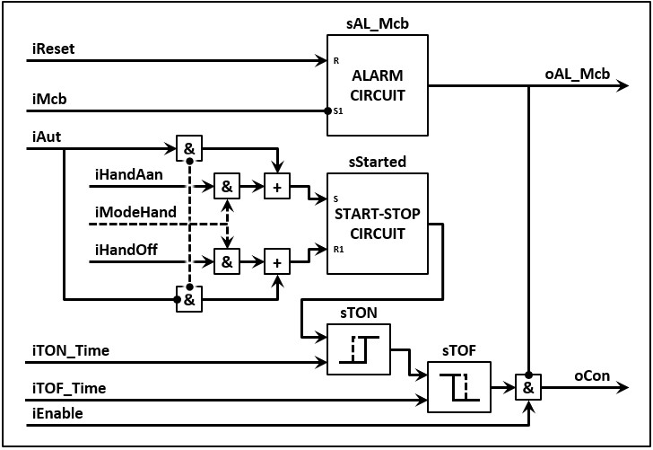
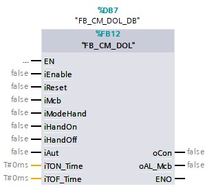

# Asynchronous motor with set speed and one turnd irection

With the current technology an asynchronous motor that only runs forward with a set speed can't operate without:
- 1x motor circuit breaker
- 1x contactor

A **control module** for this type actuator is inseperable connected with a motor circuit breaker and a contactor. The control module shortly does the following:
- If the thinkprocess(iAut) asks that the motor needs to run, the control module will let the motor run (oCon)
- But if the motor circuit breaker (iMcb) is turned off the module won't let the motor run en it'll activate the alarm (ioAL_Mcb)
- The motor will only start running again if the motor circuit breaker has been activated and the alarm reset has been reset(iReset)

One can expand the functionalities of the control module:
- The motor will only run (oCon) if the module is in enable (Enable)
- If manual mode is activated (iModeHand), the module will ignore the request from the thinkprocess (iAut) and runs the motor whenever the manual signals are given (iHandOn & iHandOut)
- If the motor needs to run (oCon) the module can start the motor with a on delay (iTON_Time) and/or a off delay(iTOF_Time)

It is possible with the description to draft a operation scheme for the control module with the name FB_CM_DOL.

The endresult is a "Function buildblock" which looks like the following images.

| Text | Image |
|--|---|
| FDB example  |   |
| More simple example  |   |
