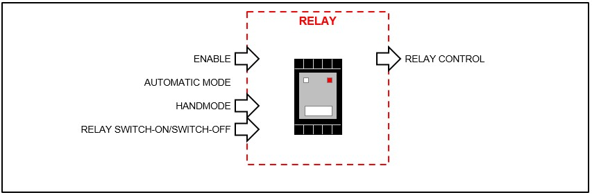
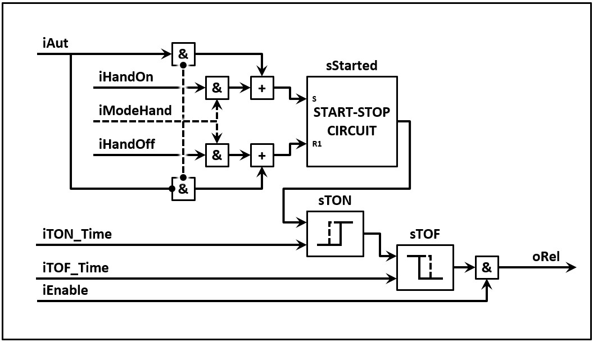
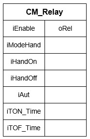

# Relay

A **relay** is often used to build up communication with:
- Other PLC's via a potential-free contacts
- Other devices like frequency controllers

Just like a asynchronous motor can one assign multiple functionalities to the corresponding control module such as:
- If the thinkprocess asks to activate the realy (iAut), the relay will be activated (oRel)
- The relay will only be activated if this is enabled (iEnable)
- If hand mode (iModeHand) is activated then will the module ignore the thinkprocess's signal (iAut) and activates the relay based on the handsignals
- If it's asked to activate the relay, the module has the possibility to activate a rise delay (iTON_Time) and/or drop-out delay (iTOF_Time)

It is possible with the description to draft a operation scheme for the control module with the name FB_CM_Relay

The endresult is a "Function buildblock" which looks like the following images.

| Text |Image |
| :---:      | :----            |
| FDB example  |   |
| More simple example  |   |
