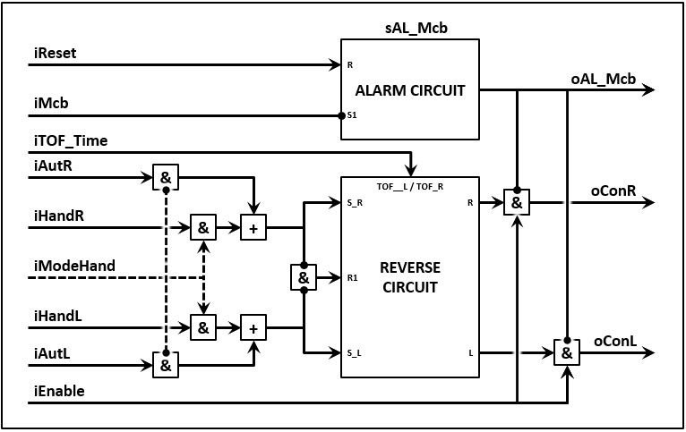

# Asynchronous motor with set speed and two turn directions

With the current technology an asynchronous motor that runs forward and backwards with a set speed can't operate without:
- 1x motor circuit breaker
- 2x contactor

A **control module** for this type actuator is inseperable connected with a motor circuit breaker and a contactor. The control module shortly does the following:
- If the thinkprocess(iAutL) asks that the motor needs to run left, the control module will let the motor run left (oConL)
- If the thinkprocess(iAutR) asks that the motor needs to run right, the control module will let the motor run right (oConR)
- It is possible to run through a wait time(iTOF_Time) if it is requested to change turn direction
- But if both directions are requested (left and right) the direction doesn't change and the motor will keep spinning the way it was before the request.
- But if the motor circuit breaker (iMcb) is turned off the module won't let the motor run en it'll activate the alarm (ioAL_Mcb)
- The motor will only start running again if the motor circuit breaker has been activated and the alarm reset has been reset(iReset)

One can expand the functionalities of the control module:
- The motor will only run (oConR & oConL) if the module is in enable (Enable)
- If manual mode is activated (iModeHand), the module will ignore the request from the thinkprocess (iAutR & iAutL) and runs the motor right(oConR) whenever the manual signal is given (iHandR)
- If manual mode is activated (iModeHand), the module will ignore the request from the thinkprocess (iAutR & iAutL) and runs the motor left(oConL) whenever the manual signal is given (iHandL)
- The control module won't change run condition if the mode changes from automatic mode (NOT iModeHand) to hand mode (iModeHand)
- It is possible with the description to draft a operation scheme for the control module with the name FB_CM_DOLRev

The endresult is a "Function buildblock" which looks like the follwing images.

|Text | Image |
--|---|--
FDB example  |   |
More simple example  |   |
