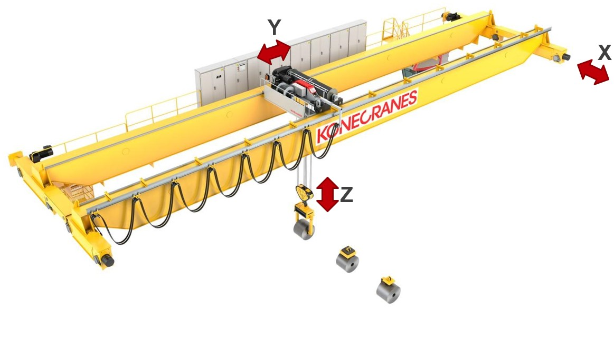

_____________________________________
# The Crane Project
## Overview
-   The [first goal](Ex01/Subchapter04_1.md) is to add ProfiNET based devices
-   The [second goal](Ex01/Subchapter04_2.md) is to add Profibus based devices
-   The [third goal](Ex01/Subchapter04_3.md) is to add a drive

Back to the [project scope](Ex01/Subchapter04.md)

## Scope

Make a network configuration of a crane that has the following:
- 5 digital sensors
- 3 motorstarters
- 2 analog sensors
- A digital levelsensor
- 2 Profibus Devices
- 1 drive

