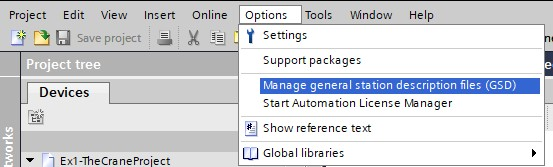
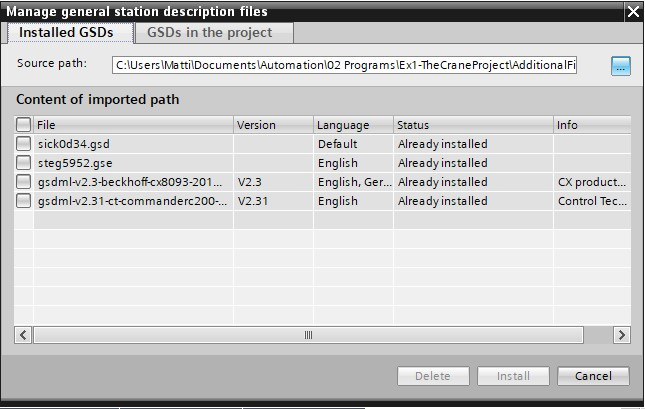
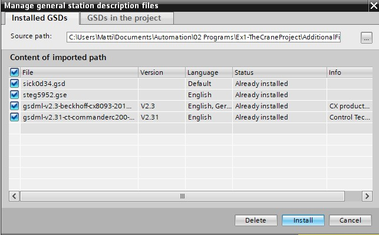

_____________________________________
# The Crane Project
## Overview
-   The [first goal](Ex01/Subchapter04_1.md) is to add ProfiNET based devices
-   The [second goal](Ex01/Subchapter04_2.md) is to add Profibus based devices
-   The [third goal](Ex01/Subchapter04_3.md) is to add Drives

Back to the [project scope](Ex01/Subchapter04.md)

## Goal 1: To add ProfiNET based devices

**Step 1 :** Create a new TIA Portal project
```javascript
Project name  : Ex1-TheCraneProject
Author        : Your name
Comment       : The Crane Project
```

**Step 2 :** Add a PLC-device with next CPU settings
```javascript
Type                          : See available CPU
System byte                   : %MB254
Clock memory byte             : %MB255
Digital input start address   : %IB0
Output start address          : %QB0
Analog input start address    : %IB64
IP-address                    : 192.168.0.30
IP-address subnet mask        : 255.255.255.0
```

**Step 3:** Search for the correct GSD files for the following devices:
```javascript
Beckhoff CX8093 island (IO on bridge)
-	3x digital sensor (grabber open, rabber closed, grabber on top)
-	2x digital sensor (eindeloop left, eindeloop right)

Siemens ET200S island 1  (pumps)
-	3x motorstarter (supply- & drainpump & heating)
-	2x analog measurement (level and temperature)
-	1x digital levelmeasurement (overflow)
```
*If there is no internet available the required GSD files are included in the Documents.*
**Overview of IP adresses and devices**


**Step 4:** Importing these GSD files:



**Step 5:** Select the right GSD files wherever you stored them:



**Step 6:** Install the selected GSD files:



**Step 7:** Import the correct devices from the "Hardware catalog" into "Network view"

**Step 8:** Connect the devices and give them the right IP adress

**Step 9:** Configure them for the right configuration given in **Step 3**
