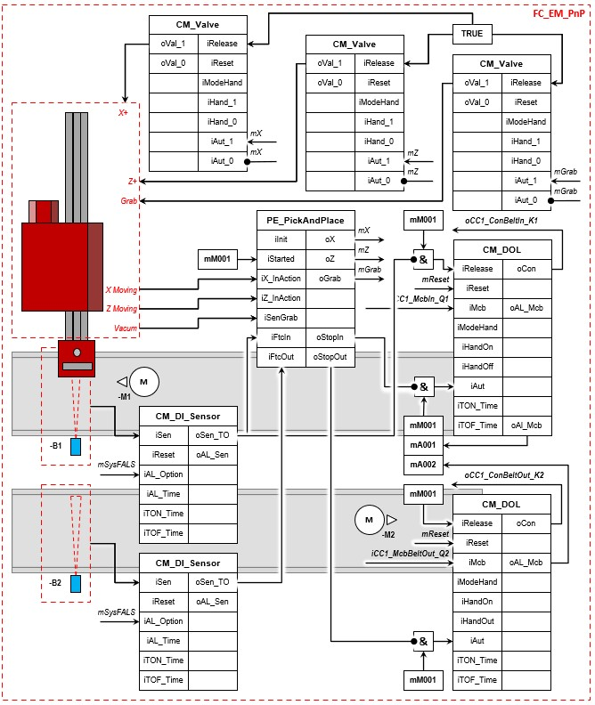

# ANSI/ISA S88

**Step 1:**

 ```javascript
Project name  : Ex2-PickAndPlace
Author        : Your name
Comment       : The pick and place project
```

**Step 2:** Add next *Functions* (FC) into PLC_1 in the FBD program language:
```javascript
S88
PE_PickAndPlace
```
**Step 3:** Add the Function into *Organization block* Main [OB1]:
```javascript
FC_S88 into network 1
```
**Step 4 :** Create the necessary PLC Tags:
```javascript
//Flags
mM001 - BOOL - %M 50.0 - SetReset for the loop manipulated value
mX - BOOL - %M50.1 - Loop manipulated value
mZ - BOOL - %M50.2 - Processvalue
mGrab - BOOL - %M50.3- Setpoint
mReset - BOOL - %M50.4 -
mUpperlimit - REAL- %MD62 - Upper limit of the controller
mUnderlimit - REAL - %MD66 - Under limit of the controller
mHyst - REAL - %MD70 - Hysteresis value
mHystDiv2 - REAL - %MD74 - Hysteresis value divided by 2
```
**Step 5 :** Program the GRAFCET:



Remarks:
Each control module has its own network.
