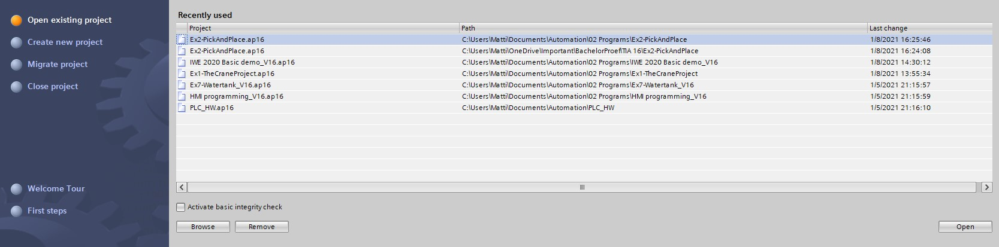
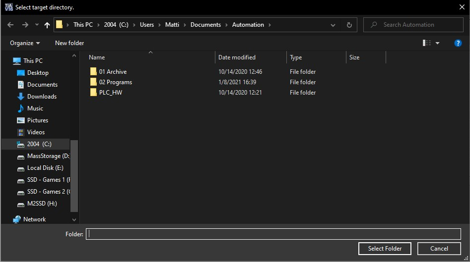
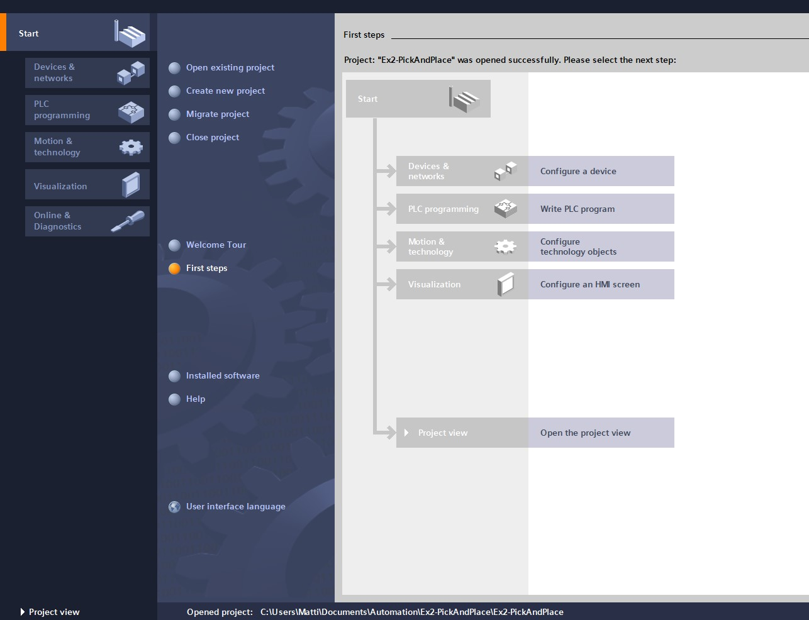

# The Pick and Place Project
_____________________________________
-   The [first goal](../Ex02/Subchapter04_01.md) is to retrieve an archived program
-   The [second goal](../Ex02/Subchapter04_02.md) is to retrieve an archived library
-   The [third goal](../Ex02/Subchapter04_03.md) is to program the S88 following the S88 design
-   The [fourth goal](../Ex02/Subchapter04_03.md) is to import a exernal source file
-   The [last goal](../Ex02/Subchapter04_04.md) is to deliver a working project

Back to the [project scope](../Ex02/Subchapter04.md)

## Goal 1: To retrieve an archived program
_____________________________________

**Step 1:**

Copy/download the included Ex2-PickAndPlace.zap16 file. Copy the file into:
```javascript
Filename : Ex2-PickAndPlace.zap16
Destination : \Documents\Automation
```

**Step 2:** Start TIA Portal and click on "Open existing project" <p>


**Step 3:** Click on browse and search for the right archived file
```javascript
Documents\Automation\Ex2-PickAndPlace.zap16
```
**Step 4:** Once selected you'll have to select the target destination. Select Documents\Automation in our case. <p>


**Step 5:** Once this screen pops up you have succesfully opened the archive. Click on "Project view" to continue the exercise <p>

