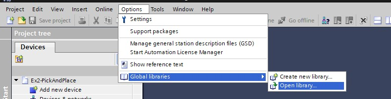
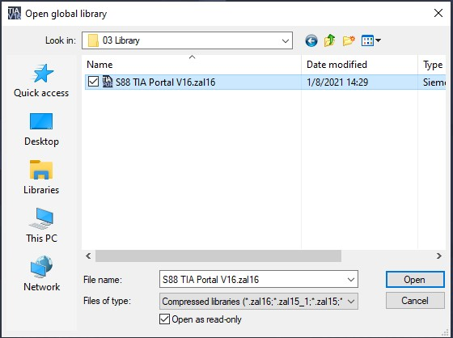
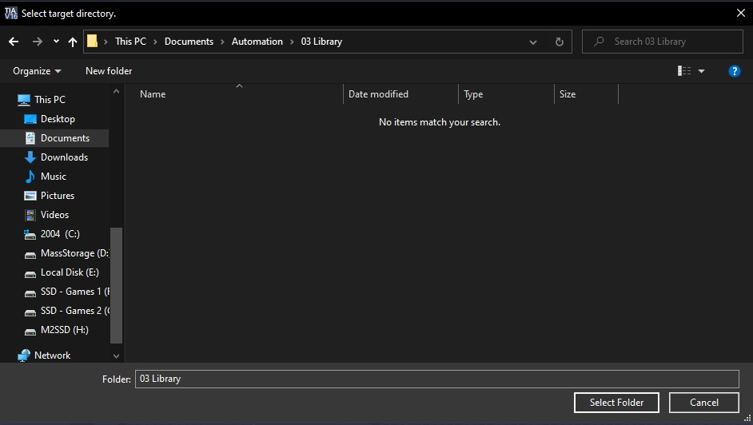
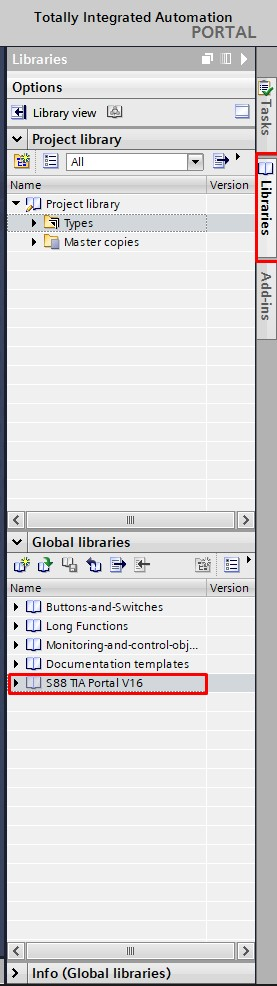

# The Pick and Place Project
_____________________________________
-   The [first goal](../Ex02/Subchapter03_01.md) is to retrieve an archived program
-   The [second goal](../Ex02/Subchapter03_02.md) is to retrieve an archived library
-   The [third goal](../Ex02/Subchapter03_03.md) is to program the S88 following the S88 design
-   The [fourth goal](../Ex02/Subchapter03_04.md) is to import a exernal source file
-   The [last goal](../Ex02/Subchapter04.md) is to deliver a working project

Back to the [project scope](../Ex02/Subchapter04.md)

## Goal 2: To retrieve an archived library
_____________________________________

The point of retrieving this archived library is that this has all the control modules and procedure elemts programmed for you. So that later when you build your S88 in TIA you can drag them from the library into your project.

**Step 1:**

Copy/download the included .zal file named. Make a new subfolder into automation called "Library". Copy the file into:
```javascript
Filename : S88 TIA Portal V16.zap16
Destination : \Documents\Automation\Library
```

**Step 2:** To select the library go to "Options > Global libraries > Open library..." <p>


**Step 3:** Open in the follwing screen the saved library

```javascript
Files of type : Compressed Libraries
Destination : \Documents\Automation\Library
```


**Step 4:**  Once selected you'll have to select the target destination. Select "Documents\Automation\Library" in our case. <p>



**Step 5:** To make sure you have got the library opened check the right bottom of TIA Portal in "Global Libraries". This is done by clicking on libraries on the right side of tia portal. <p>


