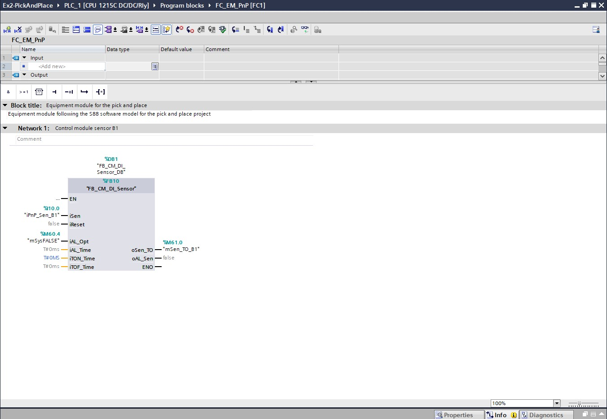
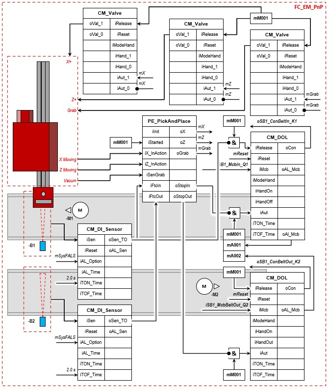

# The Pick and Place Project
_____________________________________
## Overview
-   The [first goal](Ex02/Subchapter04_1.md) is to retrieve an archived program.
-   The [second goal](Ex02/Subchapter04_2.md) is to retrieve an archived library
-   The [third goal](Ex02/Subchapter04_3.md) is to program the S88 following the S88 design
-   The [fourth goal](Ex02/Subchapter04_4.md) is to import a exernal source file
-   The [last goal](Ex02/Subchapter04_5.md) is to deliver a working project

Back to the [project scope](Ex02/Subchapter04.md)

## Goal 3: To program the S88

**Step 1:** Create the necessary PLC Tags:
```javascript
//Inputs
iCC1_McbConveyorIn_Q1 - BOOL - %I 0.0 - Motor circuit breaker for conveyor belt entry
iCC1_McbConveyorOut_Q2 - BOOL -	%I0.1	- Motor circuit breaker for conveyor belt exit
iPnP_Sen_B1 -	BOOL - %I10.0 - Sensor item at entry
iPnP_Sen_B2 - BOOL - %I10.1 - Sensor item at exit
Moving X - BOOL - %I10.2 - Robot is moving in the X axis
Moving Z - BOOL - %I10.3 - is moving in the Z axis
Vacuum - BOOL -	%I10.4 - The vacuum of the robot is active
iCC1_BtnStart_S1 - BOOL	- %I10.5 - Start button
iCC1_BtnReset_S3 - BOOL	- %I10.6 - Reset button
iCC1_BtnStop_S2	- BOOL - %I10.7	- Stop button
iCC1_BtnEms_S4	- BOOL - %I11.0	- Emergency stop button


//Outputs
iCC1_McbConveryorIn_K1 - BOOL - %Q10.0 - Contactor conveyor belt entry
iCC1_McbConveyorOut_K2 - BOOL - %Q10.1 - Contactor conveyor belt exit
Move X - BOOL - %Q10.2 - Moves the robot in the X axis
Move Z -  BOOL - %Q10.3 - Moves the robot in the Z axis
Grab - BOOL - %Q10.4 - Grabs an item
oCB1_LmpError_H1 - BOOL - %Q10.7 - Error lamp


//Flags
mM001 - BOOL - %M50.0 - System started
mA001 - BOOL - %M50.1 - Motor circuit breaker conveyot belt entry alarm
mA002 - BOOL - %M50.2 - Motor circuit breaker coneyor belt exit alarm

mZ - BOOL - %M60.1 - Flag move Z-axis of the robot
mGrab - BOOL - %M60.2 - Flag grab item
mReset - BOOL - %M60.3 - Flag reset
mSysFALSE - BOOL - %M60.4 - Flag FALSE
mStopIn	- BOOL - %M60.6 - Flag stop conveyor belt entry
mStopOut - BOOL - %M60.7 - Flag stop conveyor belt exit
mSen_TO_B1 - BOOL - %M61.0 - Flag sensor B1
mSen_TO_B2 - BOOL - %M61.1 - Flag sensor B2
mSysIlnit	- BOOL - %M60.5 - Flag initilization

```

**Step 2 :** Open the Function FC_EM_PnP[FC1]

**Step 3 :** There is one control module already present and linked to the right tags. <p>



**Step 4:** Program the remaining control modules like the following S88 design. *For each control module or procedure element you need to have a seperate network* <p>


