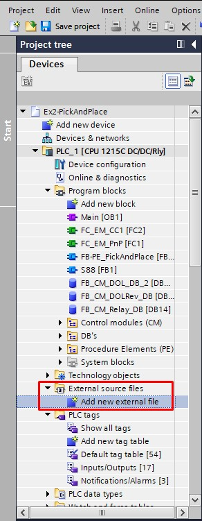
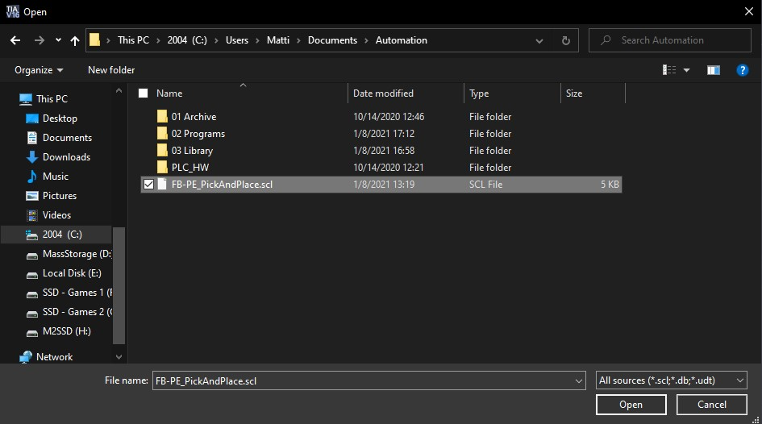
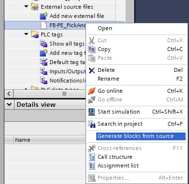

# The Pick and Place Project
_____________________________________
-   The [first goal](../Ex02/Subchapter04_01.md) is to retrieve an archived program.
-   The [second goal](../Ex02/Subchapter04_02.md) is to retrieve an archived library
-   The [third goal](../Ex02/Subchapter04_03.md) is to program the S88 following the S88 design
-   The [fourth goal](../Ex02/Subchapter04_04.md) is to import a exernal source file
-   The [last goal](../Ex02/Subchapter04_05.md) is to deliver a working project

Back to the [project scope](../Ex02/Subchapter04.md)

## Goal 4: To import a external source file
_____________________________________

**Step 1:** Download/copy FB-PE_PickAndPlace.scl and place it under
```javascript
Filename : FB-P_PickAndPlace.scl
Destination : \Documents\Automation
```
**Step 2:** Search for "External source files" in the project tree and click on "Add new external file" <p>


**Step 3:** In the file browser select FB-P_PickAndPlace.scl and open it <p>



**Step 4:** Under the "External source files" the selected file will pop up. Right click on it and run "Generate source blocks from source" <p>



**Step 5:**  Add both the Functions into *Function block* FC_EM_PnP [FC1]:

```javascript
FB-P_PickAndPlace into a new network
```

**Step 5:** Link the right tags with the block that has been generated
