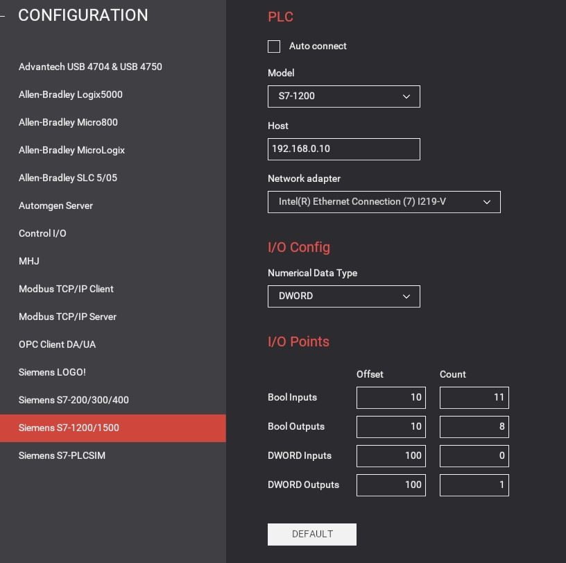

# The Pick and Place Project
_____________________________________
-   The [first goal](../Ex02/Subchapter04_1.md) is to retrieve an archived program.
-   The [second goal](../Ex02/Subchapter04_2.md) is to retrieve an archived library
-   The [third goal](../Ex02/Subchapter04_3.md) is to program the S88 following the S88 design
-   The [fourth goal](../Ex02/Subchapter04_4.md) is to import a exernal source file
-   The [last goal](../Ex02/Subchapter04_5.md) is to deliver a working project

Back to the [project scope](../Ex02/Subchapter04.md)

## Goal 5: To deliver a working project
_____________________________________

**Step 1:** Open the FactoryIO scene called "Pick and Place" (it's one of the default scene's)

**Step 2:** Configure the driver to the right PLC

**Step 3:** Open up the configuration

```javascript
IP adress: 192.168.0.10
Bool inputs: 10
Bool outputs: 10
```


**Step 4:** Compile the hardware with a rebuild all command

**Step 5:** Compile the software with a rebuild all command

**Step 6:** Download hardware and software to the PLC_1

**Step 7:** Test the Project

__Normal functionallity__
- Start the conveyorbelt by pressing the start button in FactoryIO
- The sensor will detect an item on the entry conveyor belt
- Entry conveyor belt will stop and the robot will pick up the item
- Exit conveyor belt will stop and the robot will put down the item
