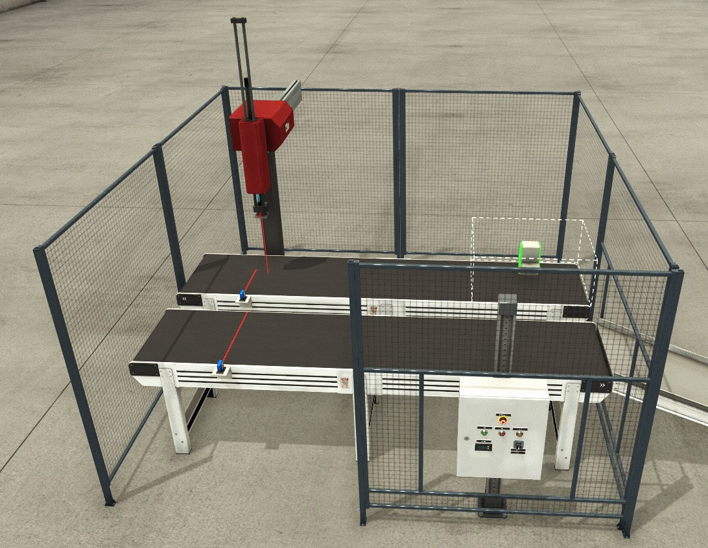

# The Pick and Place Project
_____________________________________
-   The [first goal](Ex03/Subchapter03.md) is to program a GRAFCET
-   The [second goal](Ex03/Subchapter04_1.md) is to program a Flowchart
-   The [third goal](Ex03/Subchapter05.md) is to deliver a working project

Back to the [project scope](Ex03/Subchapter03.md)

## Scope

Automate the process of picking up packages and placing them on a different conveyor. This will be equipped with the following:

- 2 Digital photocells
- 2 Digital motor circuit breakers
- 2 Digital preasurised air valves
- 2 Digital contactors to control the conveyorbelt motors
- A digital vacuum grabber



Use the buttons on the PLC to control the motor circuit breakers.
Use the control board in FactoryIO to start and stop the machine.


## Goal 1: To program a GRAFCET
_____________________________________

**Step 1:** Open the previous exercise Ex2-PickAndPlace.
```javascript
Filename : Ex2-PickAndPlace.ap16
```

**Step 2:** Remove the function block that we previously ported into TIA.
```javascript
Functionblock : FB-P_PickAndPlace
```
**Step 3:** Copy/download the included .zal file named. Make a new subfolder into automation called "Library"(If it doesn't exist already). Copy the file into:
```javascript
Filename : S88 GRAFCET.zap16
Destination : \Documents\Automation\Library
```
**Step 4:** Open the archive as we did in Ex02. Here you'll find a template of a GRAFCET under "Master Copies" called "FB-P_GRAFCET". Drag this into your TIA portal project.

**Step 5:** Rename the block to FB-P_PickAndPlace.

*Remark: The previous block "FB-P_PickAndPlace" in "FC_EM_PnP" will be red, to fix this right click on the block and press "Update block call".*

**Step 6:** Program the following GRAFCET into FB-P_PickAndPlace.

