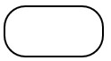
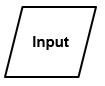
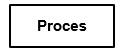
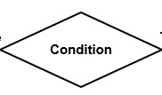
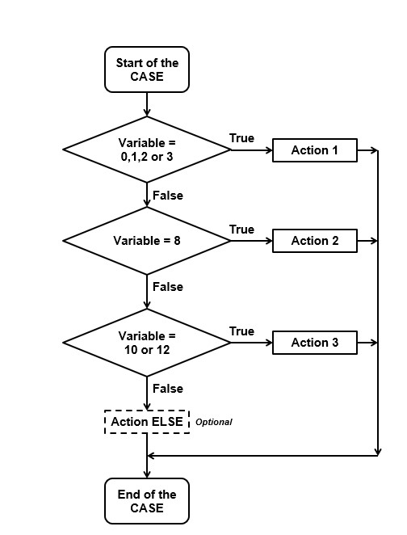
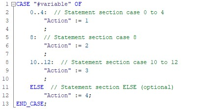
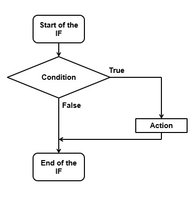
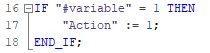

# Introduction into flowchart
_____________________________________
# Basic Symbols used in Flowchart Designs

**Terminal:** The oval symbol indicates Start, Stop and Halt in a program’s logic flow. A pause/halt is generally used in a program logic under some error conditions. Terminal is the first and last symbols in the flowchart.

**Input/Output:** A parallelogram denotes any function of input/output type. Program instructions that take input from input devices and display output on output devices are indicated with parallelogram in a flowchart.

**Processing:** A box represents arithmetic instructions. All arithmetic processes such as adding, subtracting, multiplication and division are indicated by action or process symbol.

**Decision:** Diamond symbol represents a decision point. Decision based operations such as yes/no question or true/false are indicated by diamond in flowchart.

**Case example:**
| **Flowchart** | **TIA code** |
| :---: | :---: |
|   |   |

**If example:**
| **Flowchart** | **TIA code** |
| :---: | :---: |
|   |   |
