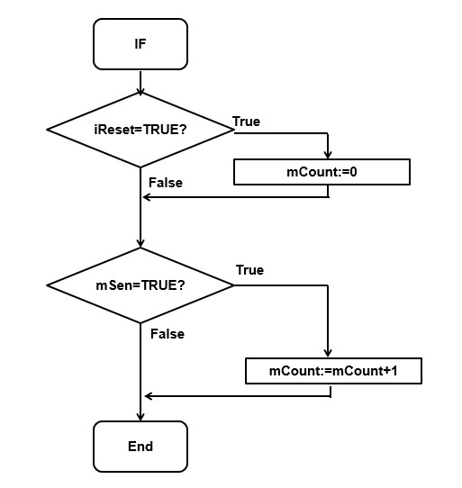
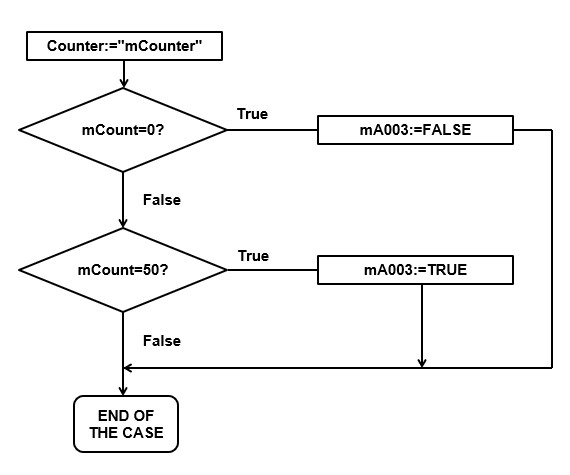

# The Pick and Place Project
_____________________________________
-   The [first goal](../Ex03/Subchapter03.md) is to program a GRAFCET
-   The [second goal](../Ex03/Subchapter04_1.md) is to program a Flowchart
-   The [third goal](../Ex03/Subchapter05.md) is to deliver a working project

Back to the [project scope](../Ex03/Subchapter03.md)

## Goal 2: To program a Flowchart
_____________________________________

[Introduction to Flowchart](../Ex03/Subchapter04.md)

**Step 1:** Create the necessary PLC Tags:
```javascript
//Outputs
Counter - DWORD - %QD100 - Amount of processed packages

//Flags
mA003 - BOOL - %M50.3 - Motor circuit breaker coneyor belt exit alarm
mCounter - DWORD - %QD100 - Flag amount of processed packages
```

**Step 2:** Create the Function Block FB_Counter[FB1] in the language SCL

**Step 3:** Create the necessary block tags:
```javascript
//Static
mSen - BOOL - Rising edge detection for sensor on the output conveyor
```
**Step 4:** Add a rise edge direction for "mSen_TO_B2"
*Remark "mSen_TO_B2" will be the input and "mSen" will be the output*

**Step 5:** Create the following Flowcharts


