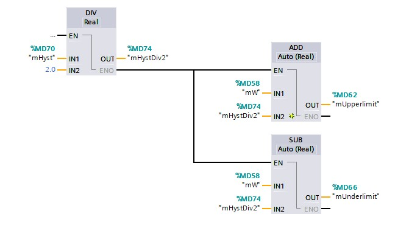
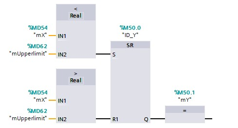
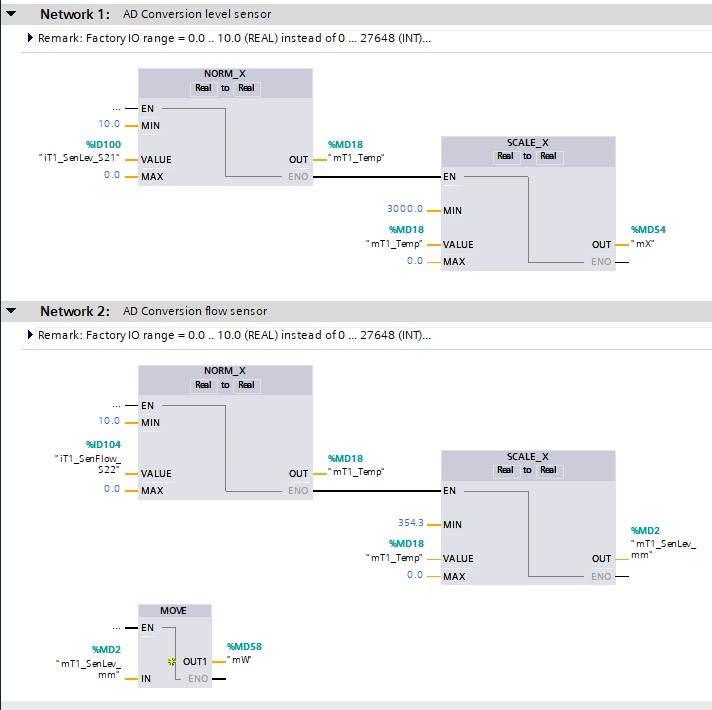
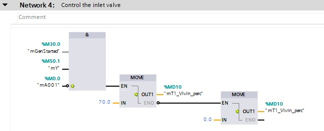

# ON-OFF controllers

## Goal 1 to program ON-OFF controllers
**Step 1:** Open project Ex7-Watertank
**Step 2:** Add next *Functions* (FC) into PLC_1 in the FBD program language:
```javascript
FC_ON/OFF
```
**Step 3:** Add the Function into *Organization block* Main [OB1]:
```javascript
FC_ON/OFF into network 3
```
**Step 4 :** Create the necessary PLC Tags:
```javascript
//Flags
ID_Y - BOOL - %M 50.0 - SetReset for the loop manipulated value
mY - BOOL - %M50.1 - Loop manipulated value
mX - REAL - %MD54 - Processvalue
mW - REAL - %MD58 - Setpoint
mUpperlimit - REAL- %MD62 - Upper limit of the controller
mUnderlimit - REAL - %MD66 - Under limit of the controller
mHyst - REAL - %MD70 - Hysteresis value
mHystDiv2 - REAL - %MD74 - Hysteresis value divided by 2
```
**Step 5 :** Program the ON-OFF controller:



**Step 6 :** Program the threshold:



**Step 7 :** Change the existing code, delete the level control network:




**Step 8 :** Hysteresis

**Step 9 :** Download the software and test the
