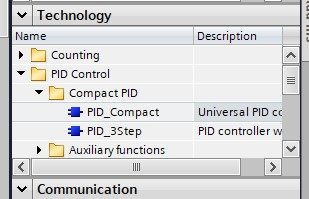
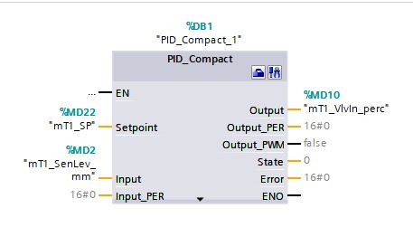

# The Watertank Project
_____________________________________
-   The [first goal](../Ex04/Subchapter03_1.md) is to program an ON/OFF controller
-   The [second goal](../Ex04/Subchapter04.md) is to program a PID controller
-   The [third goal](../Ex04/Subchapter05.md) is to deliver a working program

Back to the [project scope](../Ex04/Subchapter03.md)

## Goal 2: To program a PID controller
_____________________________________

**Step 1:** Open project Ex7-Watertank

**Step 2:** Delete network 4 : Level control

**Step 3:** Create a cyclic interrupt

**Step 4:** Add PID_Compact into *cyclic interrupt*



**Step 5:** Connect the right in- & outputs



**Step 6:**  Delete network 5 : Control the inlet valve


**Step 7:** Configure the PID_Compact


**Step 8:** Play with the following paramaters


**Step 9 :** Open the FactoryIO scene called:
```javascript
Filename : Level_Control.factoryio
Filelocation : \Documents\Factory IO\My Scenes
```
**Step 10:** Compile the hardware with a rebuild all command

**Step 11:** Compile the software with a rebuild all command

**Step 12:** Download hardware and software to the PLC_1

**Step 13:** Test the Project

__Testing__
- Try changing the controller structure and see what it does
- Try changing Proportian gain and see what it does
- Try changing the sampling time of the PID algorithm
- Play around with these values and see what they do
