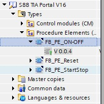
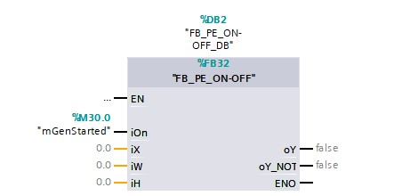

# The Watertank Project
_____________________________________
## Overview
-   The [first goal](Ex04/Subchapter04_1.md) is to program an ON/OFF controller
-   The [second goal](Ex04/Subchapter04_2.md) is to program a PID controller
-   The [third goal](Ex04/Subchapter04_3.md) is to deliver a working program

Back to the [project scope](Ex04/Subchapter04.md)

## Goal 1: To program an ON/OFF controller
_____________________________________

**Step 1:** Open project Ex7-Watertank

[The Watertank Project](Ex04/Documents/Ex7-Watertank_V16.zap16)

**Step 2:** Open the *Function* FC_T1[FC2]

**Step 3:** Delete the content within network 4 : Level control <P>

**Step 4:** Open the library "S88 TIA Portal V16"

**Step 5:** Copy "FB_PE_ON-OFF" into the *Function* FC_T1[FC2] network 4 : <P>



**Step 6:** Link the right in- & outputs of the ON-OFF controller.<P>



**Step 8 :** Open the FactoryIO scene called:
[Level_Control.factoryio](./Ex04/Documents/Level_Control.factoryio)
```javascript
Filename : Level_Control.factoryio
Filelocation : \Documents\Factory IO\My Scenes
```
**Step 9:** Compile the hardware with a rebuild all command

**Step 10:** Compile the software with a rebuild all command

**Step 11:** Download hardware and software to the PLC_1

**Step 12:** Test the Project

__Normal functionallity__
- If you change the iH value the hysteresis of the controller will change
- If you change the iW value the setpoint will change
- The on/off controller will control the level set by you in iW
- Play around with these values and see what they do
