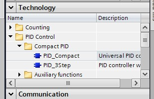
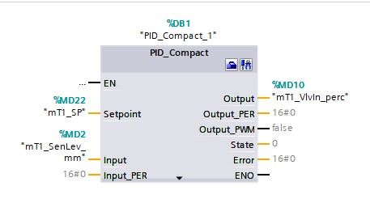
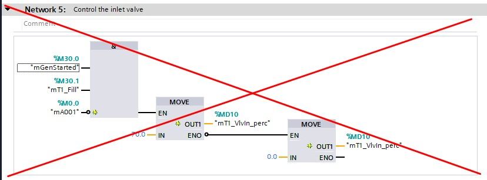
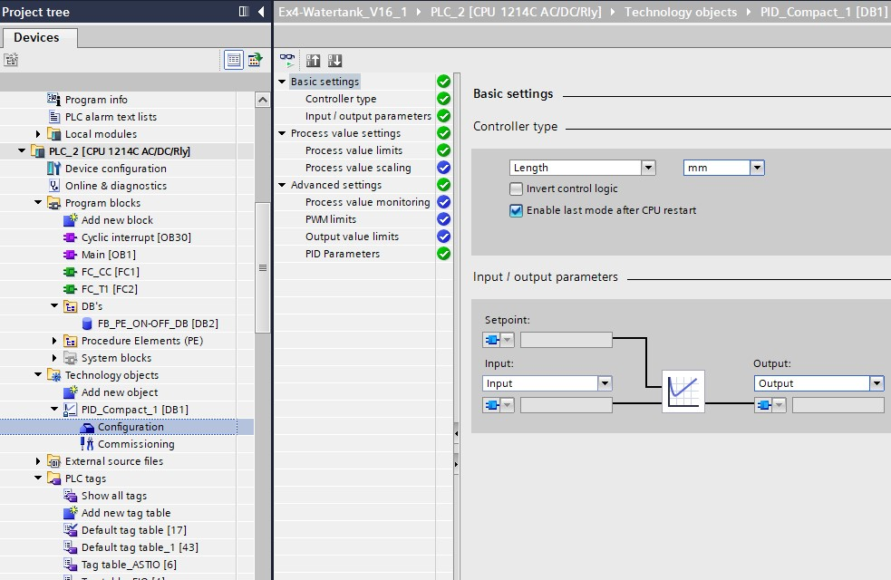
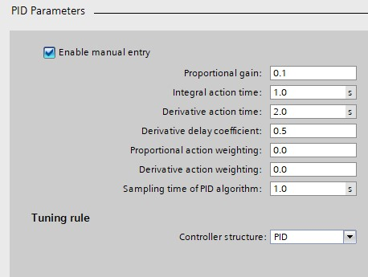

_____________________________________
# The Watertank Project
## Overview
-   The [first goal](Ex04/Subchapter04_1.md) is to program an ON/OFF controller
-   The [second goal](Ex04/Subchapter04_2.md) is to program a PID controller
-   The [third goal](Ex04/Subchapter04_3.md) is to deliver a working program

Back to the [project scope](Ex04/Subchapter04.md)

## Goal 2: To program a PID controller

**Step 1:** Open project Ex7-Watertank
[The Watertank Project](Ex04/Documents/Ex7-Watertank_V16.zap16)

**Step 2:** Delete network 4 : Level control

**Step 3:** Create a cyclic interrupt

**Step 4:** Add PID_Compact into *cyclic interrupt*



**Step 5:** Connect the right in- & outputs



**Step 6:**  Delete network 5 : Control the inlet valve



**Step 7:** Configure the PID_Compact



**Step 8:** Play with the following paramaters



**Step 9 :** Open the FactoryIO scene called:
[Level_Control.factoryio](./Ex04/Documents/Level_Control.factoryio)
```javascript
Filename : Level_Control.factoryio
Filelocation : \Documents\Factory IO\My Scenes
```
