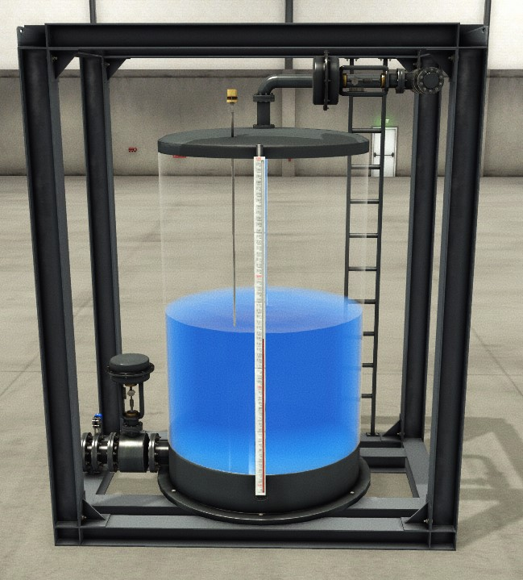
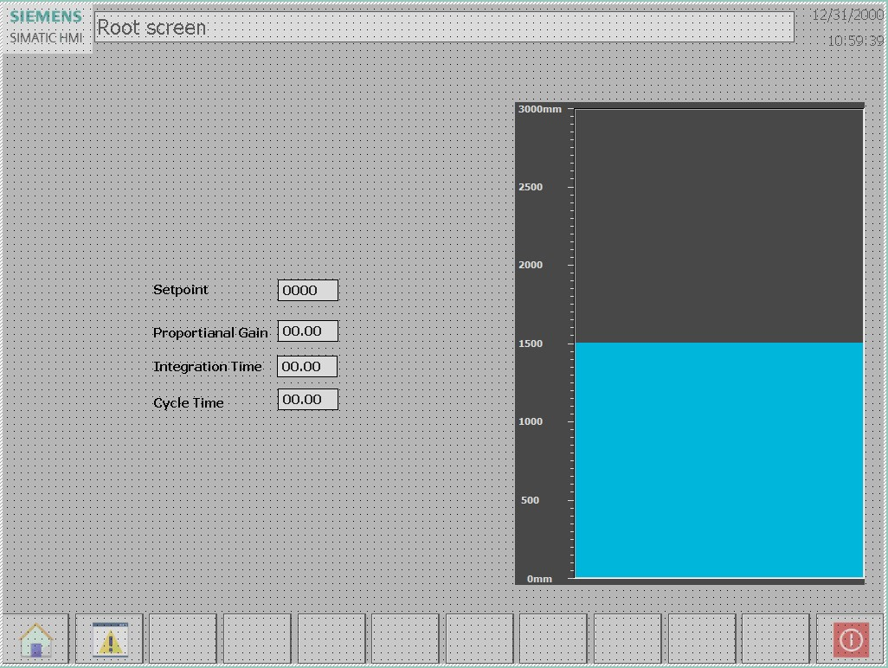
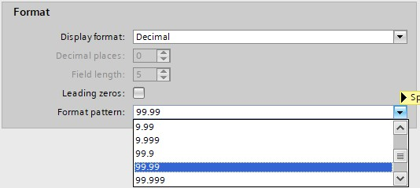
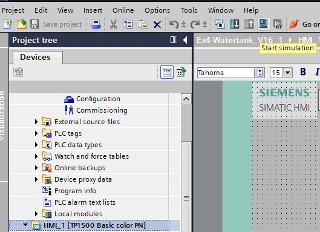

# The Watertank Project
_____________________________________

## Scope

Automate controlling the level in **watertank T1**. that is equipped with
- An analog level sensor
- An analog flow sensor on the outlet
- An analog inlet valve
- An analog outlet valve



Use the HMI simulation to control the tank leven and control the PID parameters

**Step 1:** Open project Ex4-Watertank

**Step 2 :** Open the FactoryIO scene called:
[Level_Control.factoryio](./Ex05/Documents/Level_Control.factoryio)
```javascript
Filename : Level_Control.factoryio
Filelocation : \Documents\Factory IO\My Scenes
```
**Step 3:** Add a TP1500 Basic color PN HMI panel to the project
**Step 4:** Link the HMI to the PLC configured in the project.
```javascript
IP-address                    : 192.168.0.31
IP-address subnet mask        : 255.255.255.0
```
**Step 5:** Create the following HMI screen, (adjust the PID parameters through HMI)


*Remark: to show and use the parameters in 00.00 values in a IO field;*


**Step 6:** Start the HMI simulation



*Remark: if the HMI simulation can't find your PLC connection go to the following*
```javascript
"C:\Program Files\Common Files\Siemens\CommunicationSettings"
```

Acces point > S7ONLINE > "Your networkcard"

__Normal functionallity__
- The PID will slowly increase(or decrease) when setpoint changes and ultimately stop at the setpoint
- Play with the PID parameters until it works
