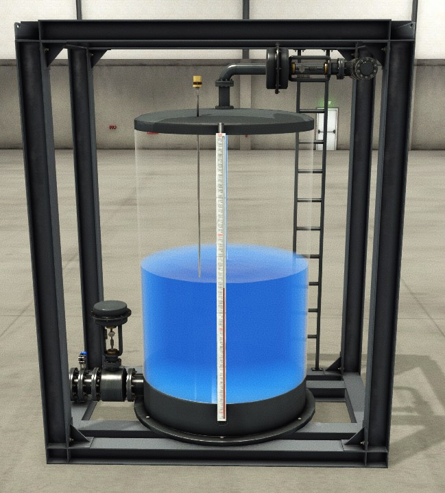
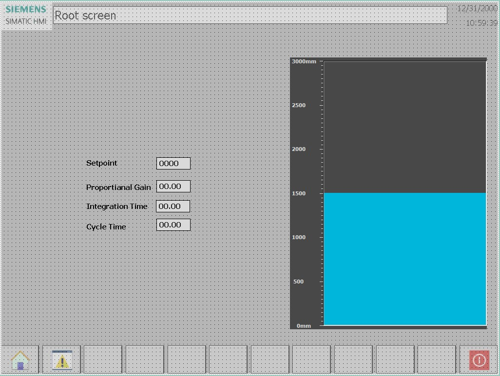
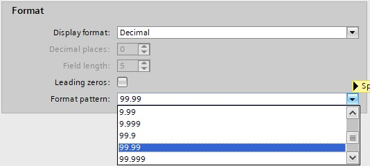

_____________________________________
# The Watertank Project
## Scope

Control the level in **watertank T1** that is equipped with
- An analog level sensor
- An analog flow sensor on the outlet
- An analog inlet valve
- An analog outlet valve



Use the HMI simulation to control the tank level and adjust the PID parameters.

**Step 1:** Open project Ex4-Watertank

**Step 2 :** Open the FactoryIO scene called:
[Level_Control.factoryio](./Ex05/Documents/Level_Control.factoryio)

```javascript
Filename : Level_Control.factoryio
Filelocation : \Documents\Factory IO\My Scenes
```
**Step 3:** Add a TP1500 Basic color PN HMI panel to the project

**Step 4:** Link the HMI to the PLC configured in the project

```javascript
IP-address                    : 192.168.0.31
IP-address subnet mask        : 255.255.255.0
```
**Step 5:** Create the following HMI screen, (adjust the PID parameters through HMI)



*Remark: to show and use the parameters in 00.00 values in a IO field;*



**Step 6:** Start the HMI simulation


*Remark: If the HMI simulation can't find a PLC connection you need to setup the S7ONLINE Access Point to your network ethernet card that is connected with the PLC, in the SIMATIC Communication Settings.*

```javascript
"C:\Program Files\Common Files\Siemens\CommunicationSettings\CommunicationSettings.exe"
```

__Normal functionallity__
- The PID will slowly increase (or decrease) when setpoint changes and ultimately stop at the setpoint
- Play with the PID parameters until it works
